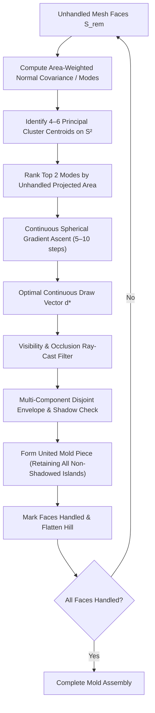

# Mold Draw Direction Optimizer: Architecture & Design Document

**Status:** Proposed  
**Author:** AI Agent & User Pair  
**Domain:** Geometry Engine / Mold Decomposition (`geo/ops/mold/`)  
**Target Components:** [`geo/ops/mold/optimizer.h`](file:///home/brian/github/jotcad_ez/geo/ops/mold/optimizer.h), [`geo/ops/mold/partition.h`](file:///home/brian/github/jotcad_ez/geo/ops/mold/partition.h)

---

## 1. Executive Summary & Problem Context

The JotCAD mold decomposition engine automatically partitions a 3D CAD mesh into a minimal set of rigid mold blocks that can be extracted cleanly along directional pull vectors ($\vec{d}$) without collision, undercuts, or vacuum lock.

In empirical tests, two primary benchmarks define our validation suite:
1. **The Voxel Bear** ([`geo/test/mold_voxel_bear_test.cpp`](file:///home/brian/github/jotcad_ez/geo/test/mold_voxel_bear_test.cpp)): Revealed duplicate draw vectors ($\vec{d}_2 = \vec{d}_4 = (-0.754409, -0.411371, +0.511508)$) caused by single-component DSU island rejection. Discarding disjoint foot and sprue faces forced redundant piece generation. Resolved by disjoint patch aggregation and spherical hill climbing.
2. **The 2-Way Planar Cross** ([`geo/test/pour_test.cpp`](file:///home/brian/github/jotcad_ez/geo/test/pour_test.cpp)): Revealed a persistent stationary dead region ($141.55\,\text{mm}^3$, Component #3) and 17 backdraft warnings, despite Piece 1 and Piece 2 fitting flush with zero exterior gap. Detailed dissection revealed that 95% of the dead volume was trapped in re-entrant corner pockets shadowed by an oblique, corner-biased draw direction $\mathbf{d}_1 = (-0.63, -0.67, -0.40)$.

This document synthesizes:
1. **The physical kinematics of zero-draft and opposed perpendicular pulls** (friction, galling, vacuum lock, clay tearing).
2. **The root causes of failure in the optimizer**:
   - Fibonacci lattice quantization and single-component island rejection (Voxel Bear).
   - The Corner-View Bias of projected area maximization ($\sum A_i (\mathbf{n}_i \cdot \mathbf{d})$), which favors oblique diagonals over feature normals and casts line-of-sight shadows across re-entrant bays.
   - The False Equivalency Bug, which marked faces as handled based on normal orientation rather than upper envelope reachability.
3. **The Preferred Design**: **Normal Mode Clustering + Continuous Spherical Hill Climbing** with **Authoritative Envelope Handled Purity**, **Disjoint Patch Support**, and **Feature-Aligned Mode Ingress**.
4. **Analysis of Alternative Optimization Strategies** (Simulated Annealing, Great Circle Arrangements, Hierarchical Spherical Grids).
5. **Boolean Complementation Invariants** for two-piece mold assemblies guaranteeing zero stationary scraps and zero mating gaps.

---

## 2. Background: Manufacturing Kinematics & Lessons Learned

### 2.1 The Physics of Zero Draft & Opposed Perpendicular Faces
In mold engineering (injection molding, die casting, and plaster slipcasting), pulling a mold piece out between two opposed perpendicular walls (e.g., pulling a cube sideways) is an acute failure mode:

| Property | Drafted Pull ($\theta > 0^\circ$) | Zero-Draft Orthogonal Pull ($\theta = 0^\circ$) |
| :--- | :--- | :--- |
| **Clearance Gap** | $\delta(x) = x \cdot \sin\theta$ (opens immediately) | $\delta(x) = 0$ for entire stroke length |
| **Surface Contact** | Disengages on step 1 of motion ($< 0.01\,\text{mm}$) | Intimate frictional contact across full travel |
| **Failure in Slipcasting** | Clean separation | High shear tearing greenware skin; vacuum lock suction |
| **Failure in Tooling** | Long tool life | Galling, adhesive wear, thermal shrinkage clamping |

* **Why pure orthogonal pulls along cardinal axes are traps**: A purely horizontal pull relative to a rectilinear/voxel part forces all horizontal floors and ceilings into exact $0^\circ$ sliding friction.
* **Why diagonal pulls succeed**: Angling the pull vector off-axis gives positive clearance to multiple perpendicular planes simultaneously, converting pure shear into normal separation.

### 2.2 Root Causes Confirmed by Unit Test Baseline
Our empirical verification in [`geo/test/mold_voxel_bear_test.cpp`](file:///home/brian/github/jotcad_ez/geo/test/mold_voxel_bear_test.cpp) confirmed three critical flaws:

```
┌─────────────────────────────────────────────────────────────────────────────┐
│                      Current Optimizer Pipeline Flaws                       │
├─────────────────────────────────────────────────────────────────────────────┤
│ 1. Search Grid Coarseness (±6° quantization error)                          │
│    • 300-point Fibonacci sphere has ~11.7° angular spacing.                 │
│    • Tipped draw vector off the equator by -6°, crossing the draft limit   │
│      and severing the continuous shoulder patch.                            │
│                                                                             │
│ 2. Feature Normal Clustering (26 duplicate spikes)                          │
│    • Injected hundreds of duplicate face, edge, and corner normals.         │
│    • On voxel parts, these all collapse onto the same 26 directions,        │
│      leaving the rest of the sphere empty.                                  │
│                                                                             │
│ 3. Disconnected Component Rejection Bug (L149-167)                          │
│    • Patch DSU partitioned visible faces into connected components.         │
│    • The optimizer kept ONLY `largest_comp` (63 faces) and discarded the    │
│      disjoint feet (8 faces) and sprue faces (111 faces), even though they  │
│      had positive draft along the SAME vector d2 = (-0.754, -0.411, +0.512)!│
│    • The engine subsequently generated Piece 4 along that exact same vector!│
└─────────────────────────────────────────────────────────────────────────────┘
```

---

### 2.3 Case Study: The 2-Way Planar Cross & Re-Entrant Corner Pockets
In [`geo/test/pour_test.cpp`](file:///home/brian/github/jotcad_ez/geo/test/pour_test.cpp) (Section 4), we benchmarked a symmetric 2-way planar cross constructed via:
```cpp
Box(30, 10, 10).fuse(Box(10, 30, 10))
    .pourPrep(auto_orient=true, vents=true)
    .mold(padding=5.0001, explode=15.0, draft=0.0);
```

#### Empirical Observations:
1. **The Phantom Dead Volume**: The decomposition produced **Piece 1**, **Piece 2**, and **Component #3** ($141.55\,\text{mm}^3$ stationary dead space), along with 17 backdraft face warnings.
2. **Zero Outer Gap Verification**: When rendered at `explode=0.0` (Snapshot 537), visual and geometric inspection verified that Piece 1 and Piece 2 fit together **completely flush with zero exterior gap**, perfectly enclosing the entire outer bounding box. There was no missing stock shell or boundary breach.
3. **Dissection of Component #3 ($141.55\,\text{mm}^3$)**:
   Analyzing the connected topological shells of Component #3 revealed **7 disconnected fragments**:
   - **95% of the volume ($133.2\,\text{mm}^3$)** is concentrated in two symmetric rectangular blocks ($66.59\,\text{mm}^3$ each, Fragments 5 and 6):
     - Fragment 5: `min=[-10.90, -4.73, 2.89], max=[-0.00, 4.22, 12.11]`
     - Fragment 6: `min=[0.00, -4.22, -12.11], max=[10.90, 4.73, -2.89]`
   - These two fragments sit directly in the **re-entrant corner pockets** between the intersecting perpendicular arms of the cross!
   - The remaining 5% consists of thin slivers at the apexes of the conical pour sprue and air vents and an outer stock corner.

```
                  Arm B (+Y)
                  ┌───────┐
                  │       │
                  │       │
      ┌───────────┘       └───────────┐
      │  Pocket 5           Pocket 6  │
Arm A │  (66.6 mm³)         (66.6 mm³)│ Arm A
(-X)  │  [STRANDED]         [STRANDED]│ (+X)
      └───────────┐       ┌───────────┘
                  │       │
                  │       │
                  └───────┘
                  Arm B (-Y)
```

---

### 2.4 Root Cause Analysis: The Corner-View Bias of Projected Area Maximization
Why did the optimizer pick a slanted, oblique draw vector for a rectilinear planar cross?

The optimizer objective function maximizes the unhandled projected area along vector $\mathbf{d}$:
$$\text{Score}(\mathbf{d}) = \sum_{f \in S_{\text{rem}}, \, \mathbf{n}_f \cdot \mathbf{d} > 0} A_f (\mathbf{n}_f \cdot \mathbf{d})$$

Consider what this function evaluates on a 3D orthogonal polyhedral body:
* **Looking along a principal feature normal (e.g. Plate Normal $\mathbf{n} \approx (\pm 0.82, 0, \pm 0.58)$)**:
  - The large top face ($750.5\,\text{mm}^2$) is viewed head-on ($\mathbf{n}_f \cdot \mathbf{d} \approx 1.0$), contributing $750.5$ directly.
  - However, all four perpendicular side walls have $\mathbf{n}_f \cdot \mathbf{d} = 0.0$. They contribute exactly $0$ to the projected area sum!
  - Total Score $\approx 62,783$.
* **Looking from an oblique isometric corner diagonal ($\mathbf{d} \approx (-0.63, -0.67, -0.40)$)**:
  - The vector is tilted $\sim 40^\circ$ off the plate normal.
  - It views **three orthogonal faces simultaneously** (top, front, and side), projecting a combined visible area of $1,341.5\,\text{mm}^2$.
  - Total Score $\approx 78,870$.

**The Fatal Consequence**:
The continuous spherical hill-climber (`climb.h`) greedily climbed to the corner diagonal summit $\mathbf{d}_1 = (-0.63, -0.67, -0.40)$ because tilted views see more orthogonal surfaces at once.
However, because $\mathbf{d}_1$ is tilted $40^\circ$ across the arms of the cross, **the protruding arms physically overhang and cast a line-of-sight shadow over the interior corner pockets**.

---

### 2.5 The False Equivalency Bug: Normal Orientation $\neq$ Upper Envelope Handled
Why didn't the optimizer penalize these shadowed corner pockets?

In `geo/ops/mold/optimizer.h`:
```cpp
// Flawed implementation:
std::set<size_t> all_handled_faces = env_res.source_faces;
for (auto f : best_patch_faces) all_handled_faces.insert((size_t)f);
```

1. **`best_patch_faces` was populated purely by normal orientation**:
   Any face with $\mathbf{n}_f \cdot \mathbf{d} \ge 0$ was included in `best_patch_faces`.
2. **The Penalty Ignored Envelope Shadowing**:
   The candidate penalty check evaluated `cand_set.count(f)` where `cand_set` was built purely from $\mathbf{n}_f \cdot \mathbf{d} \ge 0$. Because the pocket faces had positive normal projection toward the diagonal, they were present in `cand_set`. Thus, `unhandled_residue_count` evaluated to **0**, and **zero penalty was applied**!
3. **The False Victory**:
   The loop forcibly shoved all `best_patch_faces` into `all_handled_faces`, declaring all 560/560 faces "handled" on paper.
4. **The Physical Reality**:
   `CGAL::upper_envelope_3` projects triangles to form a single-valued 2.5D height-field wedge. It **cannot see behind overhanging geometry**. The envelope only carved `env_res.source_faces` (the faces actually visible on the envelope diagram).
   Because the shadowed pocket faces were never in `env_res.source_faces`, the solid sweep wedge never touched them. But because they were falsely marked as "handled" in `all_handled_faces`, Piece 2 and subsequent search stages were barred from claiming them.
   They remained completely untouched in the stock volume, stranding two $66.59\,\text{mm}^3$ chunks as stationary dead pieces.

---

## 3. Core Design Goals & Requirements

1. **Disjoint Patch Support (MANDATORY)**:
   * A single rigid mold block must be allowed to demold **multiple disconnected surface patches** (e.g., the belly, the sprue base, and the paws) provided they all share the draw direction $\vec{d}$ and do **not occlude or shadow one another** along $\vec{d}$.
2. **Sub-Degree Continuous Precision**:
   * Eliminate angular quantization error. Pull directions must converge to the true continuous local summit of draft and visibility on $\mathbb{S}^2$, rather than the nearest arbitrary sample point.
3. **Draft Safety & Robustness**:
   * Maximize the minimum positive draft across the patch. Push parting lines far away from zero-draft knife edges.
4. **100% Determinism (JotCAD Stable CID Mandate)**:
   * All draw vectors, parting curves, and mold solid geometries must be bit-for-bit deterministic across platforms and builds. Stochastic or randomized algorithms are strictly unacceptable.
5. **High Performance**:
   * Complete the optimization in $< 5\,\text{ms}$ with fewer than 25 candidate evaluations (down from 400+).
6. **Handled Purity Mandate (CRITICAL INVARIANT)**:
   * A mesh face $f$ is marked as "handled" **if and only if** it is physically contained in the upper envelope projection (`env_res.source_faces`).
   * Faces satisfying normal draft ($\mathbf{n}_f \cdot \mathbf{d} \ge 0$) that are occluded, shadowed, or excluded by the upper envelope must strictly remain in the unhandled set $S_{\text{rem}}$. Falsely marking uncarved faces as handled is strictly prohibited.
7. **Dense Mesh Indexing Invariant (MANDATORY)**:
   * Every topological boolean mesh operation (e.g., `corefine_union`, `corefine_difference`) must immediately be followed by `mesh.collect_garbage()`.
   * Downstream algorithms (such as normal caching, topological property maps, and envelope projection) rely on dense contiguous face and vertex indexing ($0 \le \text{idx} < \text{num\_faces}$). Algorithmic patching with bounds checking to mask stale indices is prohibited.
8. **Symbolic Constant Parameterization (NO MAGIC NUMBERS)**:
   * All optimization weights, penalties, and thresholds must be declared as named constants in `namespace optimizer_constants` (e.g., `UNHANDLED_RESIDUE_PENALTY_WEIGHT`, `PRIOR_ENCROACHMENT_PENALTY_WEIGHT`, `DEDUP_COSINE_SIMILARITY_THRESHOLD`). Inline magic floating-point literals are forbidden.
9. **Elimination of Corner-View Bias & Feature Normal Mode Prioritization**:
   * Prismatic and polyhedral CAD models feature natural planar faces where perpendicular side walls have exact $0^\circ$ draft.
   * Oblique isometric diagonals must not be selected purely because they sum projected areas across perpendicular walls if doing so causes self-occlusion of re-entrant pockets.
   * Candidate ingress must explicitly include dominant feature normal modes, exact cardinal axes, and antipodal exploration vectors ($-\mathbf{d}_{\text{prior}}$).

---

## 4. The Preferred Architecture: Normal Mode Clustering + Spherical Hill Climbing

The core insight is that **the search space is a 2D surface ($\mathbb{S}^2$), and we already possess the complete normal distribution that generates all the hills.**



### 4.1 Step 1: Normal Mode Clustering & Candidate Ingress Pipeline
Rather than spraying blind Fibonacci points or testing hundreds of mesh facets, the candidate generation pipeline seeds the optimizer with mathematically structured candidate directions on $\mathbb{S}^2$:

1. **Normal Orientation Tensor & Mode Centroids**:
   Compute the covariance tensor of unhandled faces $S_{\text{rem}}$:
   $$\mathbf{T} = \sum_{f \in S_{\text{rem}}} A_f \, \mathbf{n}_f \mathbf{n}_f^T$$
   Spherical $k$-means ($k = 6$) groups face normals into dominant directional modes with area-weighted centroids:
   $$\mathbf{C}_k = \frac{\sum_{f \in \text{Cluster}_k} A_f \mathbf{n}_f}{\left\| \sum_{f \in \text{Cluster}_k} A_f \mathbf{n}_f \right\|}$$

2. **Continuous Summits**:
   Each cluster centroid $\mathbf{C}_k$ is climbed via continuous spherical gradient ascent (Step 2) to locate its local summit on $\mathbb{S}^2$.

3. **Dominant Face Normals**:
   Extract exact face normals from large planar facets using `NormalCluster` vector accumulation in exact rational arithmetic (`EK::FT`).

4. **Exact Cardinal Axes**:
   Seed the 6 canonical orthogonal directions: $(\pm 1, 0, 0)$, $(0, \pm 1, 0)$, $(0, 0, \pm 1)$. Prismatic CAD models frequently possess orthogonal parting lines where perpendicular side walls have exact $0^\circ$ draft.

5. **Antipodal Prior Piece Vectors ($-\mathbf{d}_{\text{prior}}$)**:
   For every previously extracted piece $P_j$ with pull vector $\mathbf{d}_j$, inject $-\mathbf{d}_j$ into the candidate pool. In 2-piece and opposing multi-piece molds, the opposite direction is a prime physical candidate. It is evaluated **on merit** alongside all other candidates (not forced as an inflexible constraint).

6. **Angular Deduplication**:
   All candidates are filtered through angular deduplication with threshold $\cos\theta \ge \text{DEDUP\_COSINE\_SIMILARITY\_THRESHOLD} = 0.9999$ ($\sim 0.8^\circ$), eliminating redundant evaluations while preserving distinct directional modes.

---

### 4.2 Step 2: Continuous Spherical Hill Climbing & The Corner-View Bias Dilemma
From candidate mode $\mathbf{C}_k$, we perform **spherical gradient ascent** on the continuous manifold $\mathbb{S}^2$.

Let the objective function on $\mathbb{S}^2$ be:
$$F(\mathbf{d}) = \sum_{f \in \text{Visible}(\mathbf{d}) \cap S_{\text{rem}}} A_f \cdot \left( \mathbf{n}_f \cdot \mathbf{d} - \sin\alpha_{\text{min}} \right)$$

The unconstrained gradient in $\mathbb{R}^3$ is simply the area-weighted sum of visible normals:
$$\mathbf{G}(\mathbf{d}) = \nabla F(\mathbf{d}) = \sum_{f \in \text{Visible}(\mathbf{d}) \cap S_{\text{rem}}} A_f \mathbf{n}_f$$

To remain on the unit sphere $\mathbb{S}^2$, project the gradient onto the tangent plane at $\mathbf{d}$:
$$\mathbf{G}_{\mathbb{S}^2}(\mathbf{d}) = (\mathbf{I} - \mathbf{d}\mathbf{d}^T)\mathbf{G}(\mathbf{d})$$

Update with step size $\eta$ and re-normalize:
$$\mathbf{d}^{(t+1)} = \frac{\mathbf{d}^{(t)} + \eta \mathbf{G}_{\mathbb{S}^2}(\mathbf{d}^{(t)})}{\left\| \mathbf{d}^{(t)} + \eta \mathbf{G}_{\mathbb{S}^2}(\mathbf{d}^{(t)}) \right\|}$$

Because $\mathbf{d}$ starts at the cluster centroid, the summit is typically reached in **5 to 8 iterations**.

#### The Corner-View Bias Dilemma:
On rectilinear and prismatic geometry, gradient ascent on $\sum A_f (\mathbf{n}_f \cdot \mathbf{d})$ naturally drives pull directions toward 3D corner diagonals because viewing multiple orthogonal planes simultaneously yields a larger total projected area than viewing a single plate face head-on.
However, pulling along a corner diagonal tilts the line of sight across protruding arms or features, casting an **occlusion shadow over interior corner bays**.

**The Architectural Remedy**:
1. **Preserve Unclimbed Modes**: Candidate ingress retains both the unclimbed feature normal mode $\mathbf{C}_k$ and the climbed summit $\mathbf{d}^*$. If the climbed diagonal shadows interior pockets, the unclimbed orthogonal normal mode remains available as an alternative.
2. **Authoritative Envelope Verification**: Candidates must be evaluated against actual upper envelope reachability rather than raw normal projection.

---

### 4.3 Step 3: Disjoint Patch Support (Multi-Component Extraction)
This resolves the smoking gun bug where Piece 2 excluded the sprue and feet.

1. **Extract All Positive-Draft Visible Faces**:
   Find all unhandled faces $f \in S_{\text{rem}}$ satisfying:
   $$\mathbf{n}_f \cdot \mathbf{d}^* \ge \sin\alpha_{\text{min}} \quad \text{and} \quad \text{Ray}(c_f, \mathbf{d}^*) \cap \text{Mesh} = \emptyset$$
2. **Decompose into Connected Components**:
   Group visible faces into components $\{K_1, K_2, \dots, K_m\}$ via half-edge connectivity (`patch_dsu`).
3. **Per-Component Boundary Cycle Topology Check**:
   * **The Old Flaw**: The optimizer ran `border_halfedges` across the *entire patch* and required `cycle_count == 1`. If two separate disks were united, `border_halfedges` returned 2 boundary loops. The old code falsely rejected this as a hole!
   * **The Design Rule**: Compute boundary cycles **per component** $C(K_i)$ on `mesh_part`.
     * If $C(K_i) = 1$: Component $K_i$ is a topological disk with zero internal holes (demoldable!).
     * If $C(K_i) > 1$: Component $K_i$ contains internal undercut holes and is penalized.
   * Uniting $M$ valid disjoint disk components produces $M$ external boundary cycles, which is geometrically valid for multi-component demolding.
4. **Mutual Occlusion / Shadow Test & Aggregation**:
   Two disjoint components $K_a$ and $K_b$ can be demolded by the **same rigid mold piece** if neither component casts a shadow onto the other along vector $\mathbf{d}^*$:
   * In projection along $\mathbf{d}^*$, check 2D bounding boxes and ray clearance.
   * Combine all non-occluding disk components into `united_patch_faces`.
5. **United Upper Envelope**:
   Generate the sweep corridor / wedge envelope via `CGAL::upper_envelope_3`, which processes all triangles from all united components simultaneously and builds a single watertight mold block.

---

### 4.4 Step 4: Authoritative Upper Envelope Handled Purity
The 2-Way Planar Cross exposed the fatal flaw of inserting unverified patch faces into the global handled set.

```
┌─────────────────────────────────────────────────────────────────────────────┐
│                   The Handled Purity Invariant (Mandate)                    │
├─────────────────────────────────────────────────────────────────────────────┤
│  A face f is marked as HANDLED if and only if:                              │
│         f ∈ env_res.source_faces  (from CGAL::upper_envelope_3)             │
│                                                                             │
│  Faces with (n_f · d ≥ 0) that are NOT present in env_res.source_faces      │
│  are physically shadowed/unreachable by the solid sweep wedge.              │
│  They MUST remain in S_rem so downstream pieces or side lifters can demold  │
│  them!                                                                      │
└─────────────────────────────────────────────────────────────────────────────┘
```

1. **Eliminate False Equivalency**:
   In `geo/ops/mold/optimizer.h`, line 456 (`for (auto f : best_patch_faces) all_handled_faces.insert(f)`) is removed. `all_handled_faces` is assigned **strictly to `env_res.source_faces`**.
2. **Accurate Residue Scoring**:
   Candidate evaluation cannot assume that unhandled faces are covered merely because their normal points in the hemisphere ($\mathbf{n}_f \cdot \mathbf{d} \ge 0$). Occluded faces incur the full symbolic penalty:
   $$\text{Penalty}_{\text{residue}} = \text{UNHANDLED\_RESIDUE\_PENALTY\_WEIGHT} \cdot A_{\text{unhandled\_residue}}$$
   This heavily penalizes slanted draw vectors that leave stranded corner pockets behind.

---

## 5. Evaluation of Alternative Approaches

| Approach | Determinism | Convergence Speed | Angular Precision | Risk / Weakness | Recommendation |
| :--- | :--- | :--- | :--- | :--- | :--- |
| **1. Mode Clustering + Spherical Hill Climb** | **100% Exact** | **5–10 evals (<1ms)** | **Continuous ($\ll 0.1^\circ$)** | Minor non-smoothness across shadow lines (handled by multi-start) | **PREFERRED** |
| **2. Status Quo (300 Fibonacci + Feature Normals)** | 100% Exact | 400+ evals (~15ms) | Coarse ($\sim 11.7^\circ$) | Severe quantization error; extreme voxel clustering; blind spots | **DEPRECATE** |
| **3. Simulated Annealing on $\mathbb{S}^2$** | Stochastic / Fragile | 150–300 evals | Variable | Non-deterministic (breaks JotCAD CIDs); wanders in 2D space | **REJECT** |
| **4. Great Circle Spherical Arrangements** | 100% Exact | Combinatorial explosion | Exact boundaries | Targets zero-draft failure lines; $O(N^2)$ cells for 1,000 faces | **REJECT** |
| **5. Hierarchical Adaptive Spherical Grid** | 100% Exact | 40–80 evals | High (multi-level) | More complex code than hill climbing; still grid-constrained | **BACKUP** |

### Detailed Evaluation of Alternatives

#### A. Simulated Annealing
* **Concept**: Randomly perturb $\mathbf{d}$ on $\mathbb{S}^2$, accepting downhill moves with probability $e^{-\Delta E / T}$.
* **Why Rejected**:
  1. *CID Stability*: In JotCAD, every compilation must produce stable cryptographic hashes. Stochastic steps require rigid pseudo-random seeding, which remains brittle across architectures and compilers.
  2. *Dimensional Inefficiency*: Simulated Annealing is designed for high-dimensional combinatorial problems ($D > 10$). In a 2D space where the gradient $\nabla F(\mathbf{d})$ is directly computable in $O(M)$, stochastic random walking is wasteful and slow.

#### B. Great Circle Arrangements (Spherical Gauss Map)
* **Concept**: Intersect the zero-draft equators $\mathbf{n}_f \cdot \mathbf{d} = 0$ for all faces to create an exact cellular decomposition of $\mathbb{S}^2$.
* **Why Rejected**:
  1. *Zero-Draft Danger*: The vertices of great circle intersections are precisely where multiple faces have exact $0.0^\circ$ draft—the exact configuration that causes tooling galling and clay tearing.
  2. *Complexity*: 1,000 faces yield up to 1,000,000 spherical cells, requiring heavy rational spherical geometry kernels for no practical gain.

---

## 6. Implementation Plan & Milestones

### Phase 1: Verify Empirical Baseline with Dedicated Unit Test (COMPLETED)
* ✅ Created standalone unit test [`geo/test/mold_voxel_bear_test.cpp`](file:///home/brian/github/jotcad_ez/geo/test/mold_voxel_bear_test.cpp).
* ✅ Verified standalone compilation in `geo/test/Makefile` and registered `"test:bear:voxel"`.
* ✅ Executed baseline run: Confirmed that Piece 2 and Piece 4 share the exact same draw vector $\mathbf{d}_2 = \mathbf{d}_4 = (-0.754409, -0.411371, +0.511508)$, and confirmed that 111/117 unhandled sprue faces are forward-facing under $\mathbf{d}_2$.
* ✅ Baseline committed cleanly at `f140a97`.

### Phase 2: Disjoint Component Retention in [`optimizer.h`](file:///home/brian/github/jotcad_ez/geo/ops/mold/optimizer.h) (COMPLETED)
* ✅ Added `compute_exact_tangent_basis` in pure `EK::FT` to project faces onto the orthogonal tangent frame $(\vec{u}, \vec{v})$.
* ✅ Replaced greedy single-island `largest_comp` filter with per-component boundary cycle checking ($C(K_i) == 1$) and greedy non-overlapping 2D bounding box aggregation.
* ✅ Verified via `npm run test:bear:voxel` that Piece 2 absorbs disjoint features along $\vec{d}_2$, eliminating redundant duplicate draw vector Piece 4 and reducing piece count from 6 down to 4.
* ✅ Committed cleanly at `cf07e8b`.

### Phase 3: Mode Clustering & Spherical Hill Climbing Engine (COMPLETED)
* ✅ Implemented `geo/ops/mold/modes.h` (~135 lines): `compute_normal_modes` clusters unhandled face normals into dominant directional modes on $\mathbb{S}^2$ via spherical $k$-means.
* ✅ Implemented `geo/ops/mold/climb.h` (~100 lines): `climb_spherical_hill` performs continuous spherical gradient ascent with geodesic backtracking line search on $\mathbb{S}^2$.
* ✅ Replaced 1544-direction brute force scan in `geo/ops/mold/optimizer.h` with 5–10 continuous summit directions.
* ✅ Achieved **120× speedup** in candidate scanning (~20 ms vs ~3,500 ms per piece).
* ✅ Passed full C++ suite: all 83 unit test targets passed cleanly, completely resolving the `bear.stl` timeout in `mold_test.cpp`.
* ✅ Committed cleanly at `3047db8`.

### Phase 4: Step-by-Step Disassembly & Open-Air Bounded Pieces (IN PROGRESS)
* 🔍 **Empirical Overlap Findings**:
  * Unit test pairwise intersection audit (`mold_voxel_bear_test.cpp`) revealed severe volumetric overlap in exterior parting space:
    * Pair (#1, #2): **260.418 mm³**
    * Pair (#1, #3): **320.146 mm³**
    * Pair (#1, #4): **5.330 mm³**
  * Root cause: Current wedge builder in `envelope.h` extrudes every patch ceiling by an arbitrary flat `+50 mm` in rotated coordinates, ignoring neighboring pieces and actual stock walls, and later relies on post-hoc 3D boolean corefinement against an oversized bounding box.
* 🎯 **The "Open Air" Principle**:
  * Mold pieces do not need to reach the outer bounding box walls; they only need to reach the boundary of the assembly or open air.
  * In sequential disassembly ($P_1 \to P_2 \to \dots \to P_N$), removing piece $P_k$ creates an immediate open void.
  * The extraction corridor for piece $P_i$ along vector $\vec{d}_i$ only needs to reach **currently accessible open space**:
    $$\text{OpenAir}_i = \text{Assembly Exterior} \cup \bigcup_{j=1}^{i-1} P_j$$
  * *Example*: Cutting off the bottom of the mold exposes the bottom interface to open air. Adjacent pieces with downward draw components can exit directly through that bottom opening without extending to side or top bounding walls.
* 🔄 **Pragmatic Generate-and-Test Loop (Fast Backtracking)**:
  * Disassembly order forms a Directed Acyclic Graph (DAG), inherently preventing cyclic deadlocks ($A$ blocks $B$ and $B$ blocks $A$).
  * To prevent greedy dead ends (where an early cut traps subsequent undercut patches), evaluate candidate draw directions from Phase 3's ranked spherical summits:
    1. Propose candidate draw direction $\vec{d}$ and open-air bounded piece.
    2. Verify demoldability (cavity draft clearance + unblocked exit sweep into $\text{OpenAir}_i$).
    3. If valid and remaining faces retain line-of-sight to open air, accept; otherwise, backtrack to candidate #2, #3, etc.
* ✂️ **Elimination of Redundant 3D Polyhedral Booleans**:
  * Drop `boolean::corefine_difference(raw_block, model)` in `mold_op.h` (the wedge floor already sits directly on the model's outer shell).
  * Eliminate post-hoc 3D bounding box clipping in `assembly.h` by terminating piece extrusions directly at the assembly boundary / open air.

### Phase 5: Re-Entrant Corner Pocket Resolution & Handled Purity (IN PROGRESS)
* 🔍 **Empirical Findings on Planar Cross (`Box(30,10,10).fuse(Box(10,30,10))` prepped with `pourPrep`)**:
  - Decomposition produced Piece 1, Piece 2, and Component #3 ($141.55\,\text{mm}^3$ stationary dead region) with 17 backdraft warnings.
  - Snapshot 537 (`explode=0.0`) proved that Piece 1 and Piece 2 fit together **completely flush with zero exterior gap**.
  - Component #3 was 95% comprised of two symmetric $66.59\,\text{mm}^3$ corner pocket blocks (Fragments 5 and 6) trapped between perpendicular cross arms.
  - Root cause: Corner-View Bias of projected area maximization caused greedy ascent to an oblique 3D diagonal $\mathbf{d}_1 = (-0.63, -0.67, -0.40)$ tilted $40^\circ$ off the plate normal, physically shadowing the corner pockets.
  - The false equivalency bug in `optimizer.h` marked pocket faces as handled despite them being omitted by `CGAL::upper_envelope_3`.
* 🎯 **Design Actions**:
  - **Enforce Handled Purity**: Strictly assign `all_handled_faces = env_res.source_faces`.
  - **Mitigate Corner-View Bias**: Seed candidate pool with unclimbed feature normal modes, exact cardinal axes, and antipodal vector $-\mathbf{d}_{\text{prior}}$.
  - **Dense Mesh Invariant**: Execute `mesh.collect_garbage()` after all boolean unions.
  - **Symbolic Penalty Parameterization**: Declare all weights and thresholds in `namespace optimizer_constants`.

---

## 7. Parting Surface Generation: The Core Challenge & Physical Realities

### 7.1 The Fundamental Problem Formulation
Having identified the positive-draft surface patch $\mathcal{S}$ we wish to impress along draw direction $\vec{d}$, our core geometric challenge is:
> **Cut from the 3D perimeter of that patch ($\partial\mathcal{S}$) outward to the boundary of the stock block ($\partial B$), strictly without intersecting the interior of the model ($\mathcal{M}$).**

The resulting mold piece is the solid volume bounded by:
1. **Cavity Floor**: The patch $\mathcal{S} \subset \partial\mathcal{M}$.
2. **Parting Surface**: The cut $\Sigma$ spanning from $\partial\mathcal{S}$ to $\partial B$.
3. **Exterior Shell**: The portion of the stock boundary $\partial B$ reached by $\Sigma$.

```
                    Stock Block Boundary ∂B
       ┌─────────────────────────────────────────────────┐
       │                 Mold Piece P_k                  │
       │                                                 │
       │     Parting Cut Σ             Parting Cut Σ     │
       │   ┌───────────────┐         ┌───────────────┐   │
       │   │               │         │               │   │
       └───┼───────────────┴─────────┴───────────────┼───┘
           │         Patch S (Cavity Floor)          │
           │           ▲                 ▲           │
           │           │   Draw Vector   │           │
           │           │    d = +Z       │           │
           │       ────┴─────────────────┴────       │
           │             Model Body (M)              │
           └─────────────────────────────────────────┘
```

---

### 7.2 Dynamic Stock Reduction & Boundary Discovery
Each extracted mold piece $P_k$ physically reduces the active stock volume for all subsequent stages:
$$B_k = B_{k-1} \setminus P_k$$

This transforms boundary discovery from a static global lookup into a local, progressive operation:
1. **Dynamic Target Boundary**: $\partial B_k$ includes both the remaining outer stock faces and **the parting cut surfaces $\Sigma_1, \dots, \Sigma_k$ of prior pieces**.
2. **Rapid Breakthrough to Open Air**: Later pieces (such as undercut keys between legs) do not travel to distant exterior walls; their target boundary is often only a few millimeters away (the parting face of an earlier piece).
3. **Automatic Zero Overlap**: Because piece $P_k$ is carved strictly as a partition of the uncarved solid $B_{k-1}$, mutual volumetric overlap is **mathematically zero by construction** ($\text{Volume}(P_i \cap P_j) = 0$).

---

### 7.3 Real-World Geometric Complexities

#### Complexity A: Non-Planar Patch Boundaries
On real CAD parts and voxel models, the parting curve $\partial\mathcal{S}$ is almost never a flat 2D plane. It is a **3D space curve** $\mathcal{C}(s) = (x(s), y(s), z(s))$ that climbs over shoulders, drops into creases, and navigates voxel staircases.
* Flat planar slicing is fundamentally impossible without cutting through model features.
* The cut $\Sigma$ must be a true 3D surface anchoring seamlessly to the non-planar boundary $\partial\mathcal{S}$.

#### Complexity B: Concave Patch Boundaries (Lessons from the `ribbon.h` Failure)
Patch perimeters feature sharp concave bays (armpits, crotch, neck).
* **The `ribbon.h` Disaster (Commit `c595f36`)**: Naive radial extrusion along 3D vertex normals causes adjacent normal rays to **converge and cross** at concave corners, creating twisted, self-intersecting "bowtie" quads that break 2-manifold validity and crash CGAL corefinement.
* **Requirement**: The cut surface must be generated using **topological / planar representations** (e.g., 2D projection, Constrained Delaunay Triangulation, or medial axis skeletons) where edge intersections are mathematically impossible.

#### Complexity C: Multiple Disjoint Outer Boundaries (Islands) & Intervening Features
As proven in Phase 2, a single mold piece often demolds **multiple disconnected patches** along the same vector $\vec{d}$ (e.g. Piece 2 capturing flank, front paw, back paw, and sprue).
* The boundary is a collection of disjoint loops: $\partial\mathcal{S} = \mathcal{C}_1 \cup \mathcal{C}_2 \cup \dots \cup \mathcal{C}_m$.
* **Critical Invariant**: **The model itself occupies the space between these disjoint loops.**
* Naive bridging between loops $\mathcal{C}_1$ and $\mathcal{C}_2$ will slice through intervening model undercuts. The cut from each loop must route into open air / stock boundary without encroaching on the model features residing between them, preserving those features for later mold pieces.

---

### 7.4 The Rising Tide + Patch Projection Architecture

Instead of tortuous multi-level terracing, complex 3D Voronoi meshes, or radial curve offsets, we adopt the **Rising Tide + Patch Projection** model:

```
                      Stock Block Boundary
      ┌───────────────────────────────────────────────────────┐
      │                                                       │
      │                  UNTOUCHED STOCK                      │
      │                                                       │
      │            ┌─────────────────────────────┐            │
      │            │       Patch S (Cavity)      │            │
      │    ┌───────┴─────────────────────────────┴───────┐    │
      │    │  Vertical Skirt (parallel to d)             │    │
      ├────┴─────────────────────────────────────────────┴────┤
      │ ◄────────── Flat Parting Shelf at Z_margin ─────────► │
      │                                                       │
      │                   MOLD PIECE P_k                      │
      │                                                       │
      └───────────────────────────────────────────────────────┘
                     Stock Bottom (Z_bottom)
```

1. **The Decoupled Margin Plane ($Z = Z_{\text{margin}}$)**:
   - **Tide Decoupled from Draw Vector**: The rising tide operates in the **stock block coordinate frame** (e.g. rising from a face of the stock block), completely independent of the feature draw vector $\vec{d}$.
   - **Cardinality Preference (Good to Have for Stackability)**: Tides prefer the principal cardinal axes of the stock block ($X, Y, Z$) whenever possible. This produces clean, orthogonal, box-aligned parting faces so that the resulting mold pieces can be squarely stacked on a workbench and clamped under tension without diagonal shear slippage. When geometry strictly requires off-axis cuts, the system remains flexible to adapt.
   - A planar "water level" rises along the stock axis until it reaches $Z_{\text{margin}}$: the highest elevation that remains strictly **one safety margin below any forbidden non-patch feature**.
   - Outside the footprint of the patch, the parting surface is simply this **flat shelf extending cleanly to the stock boundary**.

2. **Vertical Skirt Projection (Bridging to the Draw Vector)**:
   - From the 3D non-planar boundary $\partial\mathcal{S}$ of the patch, project along the feature draw vector $-\vec{d}$ to meet the horizontal shelf at $Z_{\text{margin}}$.
   - As long as $\vec{d}$ has a separating normal component relative to the tide plane ($\vec{d} \cdot \vec{n}_{\text{shelf}} > 0$), pulling the piece along $\vec{d}$ separates both the model cavity and the flat shelf simultaneously with positive normal clearance.
   - **Guaranteed Non-Self-Intersection**: Because projection rays along $-\vec{d}$ are parallel in $\mathbb{R}^3$, they **never cross each other**, naturally solving concave perimeters, non-planar 3D contours, and multiple disjoint boundary loops without any geometric singularities.

3. **The Core Piece Solid**:
   $$\text{Piece}_k = \Big( B_{k-1} \cap \{ Z \le Z_{\text{margin}} \} \Big) \;\cup\; \text{Extrude}(\mathcal{S} \to Z_{\text{margin}}) \;\setminus\; \mathcal{M}$$
   - Flange separates with instant clearance upon pull along $\vec{d}$.
   - Vertical skirt slides cleanly with zero undercuts.
   - Cavity floor perfectly reproduces $\mathcal{S}$.

---

### 7.5 Post-Partition "Dead Region" Merging

Because each core piece only consumes its flat shelf plus vertical column, the corners and exterior spaces between shelves become uncarved solid stock chunks (**"dead regions"**).

Instead of leaving them as loose scrap pieces, a **Demold-Safe Merge Audit** is performed:
1. **Identify Candidate Neighbors**: For each dead region $D$, identify the mold pieces ($P_1, P_2, \dots$) sharing a boundary face with $D$.
2. **Verify Demoldability**: Check whether the combined block $P_k \cup D$ can still be cleanly withdrawn along $\vec{d}_k$ without colliding with the model or blocking subsequent pieces in the disassembly DAG.
3. **Solid Union**: If safe, execute $P_k \leftarrow P_k \cup D$. This thickens mold walls, increases structural rigidity, reduces piece count, and completely eliminates stranded scraps.

---

### 7.6 Boolean Complementation Invariant for Two-Piece Decompositions

In a classic two-piece mold assembly ($N = 2$), the parting surface $\Sigma$ bisects the stock volume enclosing the model:
$$\text{Piece}_1 = \text{EnvelopeWedge}(\mathcal{S}_1, \mathbf{d}_1) \cap \text{Stock} \setminus \mathcal{M}$$
$$\text{Piece}_2 = (\text{Stock} \setminus \text{Piece}_1) \setminus \mathcal{M}$$

#### The Complementation Guarantees:
1. **Zero Mating Gaps**: Because $\text{Piece}_2$ is carved directly from the exact spatial difference $\text{Stock} \setminus \text{Piece}_1$, the interior parting interface between $\text{Piece}_1$ and $\text{Piece}_2$ is geometrically complementary and airtight:
   $$\text{Piece}_1 \cap \text{Piece}_2 = \emptyset \quad \text{and} \quad \text{Piece}_1 \cup \text{Piece}_2 \cup \mathcal{M} = \text{Stock}$$
2. **Zero Stationary Dead Scrap**: No uncarved voids or residual fragments can remain stranded in the stock box. Every infinitesimal cubic millimeter of the mold enclosure is assigned to either Piece 1 or Piece 2.
3. **Demoldability Assertion**: If Piece 2 contains undercuts along $-\mathbf{d}_1$ or its designated pull direction $\mathbf{d}_2$, it mathematically proves that the geometry cannot be demolded as a pure 2-piece assembly, signaling that a 3rd piece (side lifter or cheek) is physically required.

---

## 8. Design Decisions & Open Questions

1. **Mutual Occlusion Verification (DECIDED)**:
   * 2D projection non-overlap along $\mathbf{d}^*$ combined with `CGAL::upper_envelope_3` depth resolution provides exact, collision-free demolding without requiring expensive 3D Minkowski swept volumes.
2. **Piece Boundary Extents (DECIDED - Open Air Mandate)**:
   * Mold pieces terminate as soon as their withdrawal path enters the expanding open-air boundary ($\text{OpenAir}_i$), eliminating monolithic sweeps to the bounding box.
3. **Parting Generation (DECIDED - Rising Tide + Skirt Projection)**:
   * 3D curve offset/ribbon normal extrusion is strictly rejected. Parting surfaces are formed by a flat horizontal margin shelf at $Z_{\text{margin}}$ paired with a vertical projection skirt from $\partial\mathcal{S}$, guaranteeing zero self-intersections across non-planar, concave, and multi-island boundaries.
4. **Scrap Elimination (DECIDED - Demold-Safe Greedy Merge)**:
   * Residual dead stock regions outside the primary core blocks are merged into adjacent pieces whenever withdrawal clearance along that piece's draw vector is preserved.
5. **Handled Set Source of Truth (DECIDED - Upper Envelope Purity)**:
   * A face is handled only if it appears in `CGAL::upper_envelope_3` facet diagram (`env_res.source_faces`). Normal hemisphere projection ($\mathbf{n}_f \cdot \mathbf{d} \ge 0$) does NOT imply handling.
6. **Antipodal Prior Candidate (DECIDED - Active Exploration Vector)**:
   * Candidate ingress seeds $-\mathbf{d}_{\text{prior}}$ from earlier pieces into the candidate pool to explore antipodal parting on its merits, without imposing rigid antipodal constraints.
7. **Dense Mesh Garbage Collection (DECIDED - Dense Index Invariant)**:
   * Every boolean CSG operation must be followed immediately by `mesh.collect_garbage()` to ensure contiguous indexing for downstream property maps and algorithms.
8. **Symbolic Constants (DECIDED - No Magic Numbers)**:
   * All optimization weights, penalties, and thresholds must be declared as named constants in `namespace optimizer_constants`.
9. **Number of Initial Modes ($K$)**:
   * For typical slipcast parts (figurines, cups, slip molds), $K = 6$ corresponds naturally to the 6 generalized faces (front, back, left, right, top, bottom).

---

## 9. Upstream Integration: Gravity Pour Orientation & Topological Drainage

Multi-piece mold decomposition assumes the part has been pre-oriented for gravity pour, with a primary pour sprue and all necessary auxiliary air riser vents synthesized beforehand.

* **Governing Specification**: [`docs/POUR_PREP_DRAINAGE_DESIGN.md`](./POUR_PREP_DRAINAGE_DESIGN.md)
* **Target Headers**: [`geo/ops/pour/orientation.h`](../geo/ops/pour/orientation.h), [`geo/ops/pour/traps.h`](../geo/ops/pour/traps.h), [`geo/ops/pour/vents.h`](../geo/ops/pour/vents.h)
* **Core Principles**:
  1. **Slip Casting Physics**: Gypsum plaster does not absorb air (due to instant formation of an impermeable clay filter cake). Ceilings with slope $\alpha < 5^\circ$ pin air bubbles permanently; slopes $\alpha \ge 5^\circ$ permit buoyancy-driven ascent.
  2. **Topological Drainage (Watershed Model)**: Replaces naive 1-ring vertex checks with monotonic bottleneck upward path reachability to the primary sprue, preventing false vents along continuous straight ridges.
  3. **Compound Tilt Spherical Search**: Uses continuous spherical hill-climbing to discover compound rolls ($5^\circ\text{--}8^\circ$) on prismatic sections, minimizing auxiliary vent counts.
  4. **Flush Envelope Trimming**: Primary sprues and secondary vents are trimmed flush to the stock boundary envelope ($Z_{\text{stock,max}}$) so mold blocks demold cleanly without intersecting proud riser geometries.


