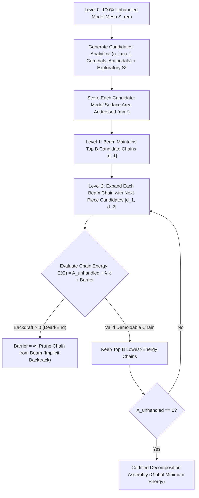

# Mold Draw Direction Optimizer: Architecture & Design Document

**Status:** Proposed  
**Author:** AI Agent & User Pair  
**Domain:** Geometry Engine / Mold Decomposition (`geo/ops/mold/`)  
**Target Components:** [`geo/ops/mold/optimizer.h`](file:///home/brian/github/jotcad_ez/geo/ops/mold/optimizer.h), [`geo/ops/mold/partition.h`](file:///home/brian/github/jotcad_ez/geo/ops/mold/partition.h)

---

## 1. Executive Summary & Problem Context

The JotCAD mold decomposition engine automatically partitions a 3D CAD mesh into a minimal set of rigid mold blocks that can be extracted cleanly along directional pull vectors ($\vec{d}$) without collision, undercuts, or vacuum lock.

In empirical tests, two primary benchmarks define our validation suite:
1. **The Voxel Bear** ([`geo/test/mold_voxel_bear_test.cpp`](file:///home/brian/github/jotcad_ez/geo/test/mold_voxel_bear_test.cpp)): Revealed duplicate draw vectors ($\vec{d}_2 = \vec{d}_4 = (-0.754409, -0.411371, +0.511508)$) caused by single-component DSU island rejection. Discarding disjoint foot and sprue faces forced redundant piece generation. Resolved by disjoint patch aggregation and spherical hill climbing.
2. **The 2-Way Planar Cross** ([`geo/test/pour_test.cpp`](file:///home/brian/github/jotcad_ez/geo/test/pour_test.cpp)): Revealed a persistent stationary dead region ($141.55\,\text{mm}^3$, Component #3) and 17 backdraft warnings, despite Piece 1 and Piece 2 fitting flush with zero exterior gap. Detailed dissection revealed that 95% of the dead volume was trapped in re-entrant corner pockets shadowed by an oblique, corner-biased draw direction $\mathbf{d}_1 = (-0.63, -0.67, -0.40)$.

This document synthesizes:
1. **The physical kinematics of zero-draft and opposed perpendicular pulls** (friction, galling, vacuum lock, clay tearing).
2. **The root causes of failure in the optimizer**:
   - Fibonacci lattice quantization and single-component island rejection (Voxel Bear).
   - The Corner-View Bias of projected area maximization ($\sum A_i (\mathbf{n}_i \cdot \mathbf{d})$), which favors oblique diagonals over feature normals and casts line-of-sight shadows across re-entrant bays.
   - The False Equivalency Bug, which marked faces as handled based on normal orientation rather than upper envelope reachability.
3. **The Preferred Design**: **Normal Mode Clustering + Continuous Spherical Hill Climbing** with **Authoritative Envelope Handled Purity**, **Disjoint Patch Support**, and **Feature-Aligned Mode Ingress**.
4. **Analysis of Alternative Optimization Strategies** (Simulated Annealing, Great Circle Arrangements, Hierarchical Spherical Grids).
5. **Boolean Complementation Invariants** for two-piece mold assemblies guaranteeing zero stationary scraps and zero mating gaps.

---

## 2. Background: Manufacturing Kinematics & Lessons Learned

### 2.1 The Physics of Zero Draft & Opposed Perpendicular Faces
In mold engineering (injection molding, die casting, and plaster slipcasting), pulling a mold piece out between two opposed perpendicular walls (e.g., pulling a cube sideways) is an acute failure mode:

| Property | Drafted Pull ($\theta > 0^\circ$) | Zero-Draft Orthogonal Pull ($\theta = 0^\circ$) |
| :--- | :--- | :--- |
| **Clearance Gap** | $\delta(x) = x \cdot \sin\theta$ (opens immediately) | $\delta(x) = 0$ for entire stroke length |
| **Surface Contact** | Disengages on step 1 of motion ($< 0.01\,\text{mm}$) | Intimate frictional contact across full travel |
| **Failure in Slipcasting** | Clean separation | High shear tearing greenware skin; vacuum lock suction |
| **Failure in Tooling** | Long tool life | Galling, adhesive wear, thermal shrinkage clamping |

* **Why pure orthogonal pulls along cardinal axes are traps**: A purely horizontal pull relative to a rectilinear/voxel part forces all horizontal floors and ceilings into exact $0^\circ$ sliding friction.
* **Why diagonal pulls succeed**: Angling the pull vector off-axis gives positive clearance to multiple perpendicular planes simultaneously, converting pure shear into normal separation.

### 2.2 Root Causes Confirmed by Unit Test Baseline
Our empirical verification in [`geo/test/mold_voxel_bear_test.cpp`](file:///home/brian/github/jotcad_ez/geo/test/mold_voxel_bear_test.cpp) confirmed three critical flaws:

```
┌─────────────────────────────────────────────────────────────────────────────┐
│                      Current Optimizer Pipeline Flaws                       │
├─────────────────────────────────────────────────────────────────────────────┤
│ 1. Search Grid Coarseness (±6° quantization error)                          │
│    • 300-point Fibonacci sphere has ~11.7° angular spacing.                 │
│    • Tipped draw vector off the equator by -6°, crossing the draft limit   │
│      and severing the continuous shoulder patch.                            │
│                                                                             │
│ 2. Feature Normal Clustering (26 duplicate spikes)                          │
│    • Injected hundreds of duplicate face, edge, and corner normals.         │
│    • On voxel parts, these all collapse onto the same 26 directions,        │
│      leaving the rest of the sphere empty.                                  │
│                                                                             │
│ 3. Disconnected Component Rejection Bug (L149-167)                          │
│    • Patch DSU partitioned visible faces into connected components.         │
│    • The optimizer kept ONLY `largest_comp` (63 faces) and discarded the    │
│      disjoint feet (8 faces) and sprue faces (111 faces), even though they  │
│      had positive draft along the SAME vector d2 = (-0.754, -0.411, +0.512)!│
│    • The engine subsequently generated Piece 4 along that exact same vector!│
└─────────────────────────────────────────────────────────────────────────────┘
```

---

### 2.3 Case Study: The 2-Way Planar Cross & Re-Entrant Corner Pockets
In [`geo/test/pour_test.cpp`](file:///home/brian/github/jotcad_ez/geo/test/pour_test.cpp) (Section 4), we benchmarked a symmetric 2-way planar cross constructed via:
```cpp
Box(30, 10, 10).fuse(Box(10, 30, 10))
    .pourPrep(auto_orient=true, vents=true)
    .mold(padding=5.0001, explode=15.0, draft=0.0);
```

#### Empirical Observations:
1. **The Phantom Dead Volume**: The decomposition produced **Piece 1**, **Piece 2**, and **Component #3** ($141.55\,\text{mm}^3$ stationary dead space), along with 17 backdraft face warnings.
2. **Zero Outer Gap Verification**: When rendered at `explode=0.0` (Snapshot 537), visual and geometric inspection verified that Piece 1 and Piece 2 fit together **completely flush with zero exterior gap**, perfectly enclosing the entire outer bounding box. There was no missing stock shell or boundary breach.
3. **Dissection of Component #3 ($141.55\,\text{mm}^3$)**:
   Analyzing the connected topological shells of Component #3 revealed **7 disconnected fragments**:
   - **95% of the volume ($133.2\,\text{mm}^3$)** is concentrated in two symmetric rectangular blocks ($66.59\,\text{mm}^3$ each, Fragments 5 and 6):
     - Fragment 5: `min=[-10.90, -4.73, 2.89], max=[-0.00, 4.22, 12.11]`
     - Fragment 6: `min=[0.00, -4.22, -12.11], max=[10.90, 4.73, -2.89]`
   - These two fragments sit directly in the **re-entrant corner pockets** between the intersecting perpendicular arms of the cross!
   - The remaining 5% consists of thin slivers at the apexes of the conical pour sprue and air vents and an outer stock corner.

```
                  Arm B (+Y)
                  ┌───────┐
                  │       │
                  │       │
      ┌───────────┘       └───────────┐
      │  Pocket 5           Pocket 6  │
Arm A │  (66.6 mm³)         (66.6 mm³)│ Arm A
(-X)  │  [STRANDED]         [STRANDED]│ (+X)
      └───────────┐       ┌───────────┘
                  │       │
                  │       │
                  └───────┘
                  Arm B (-Y)
```

---

### 2.4 Root Cause Analysis: The Corner-View Bias of Projected Area Maximization
Why did the optimizer pick a slanted, oblique draw vector for a rectilinear planar cross?

The optimizer objective function maximizes the unhandled projected area along vector $\mathbf{d}$:
$$\text{Score}(\mathbf{d}) = \sum_{f \in S_{\text{rem}}, \, \mathbf{n}_f \cdot \mathbf{d} > 0} A_f (\mathbf{n}_f \cdot \mathbf{d})$$

#### The Origin & Fallacy of "Projected Area":
In industrial molding, **projected area** ($\sum A_f \cos\theta$) serves a single specific purpose: calculating the **clamping machine tonnage** ($F_{\text{clamp}} = P_{\text{injection}} \times A_{\text{projected}}$) required to keep mold platens sealed against internal injection pressure.
In computational CAD geometry (Chen & Rosen, Priyadarshi & Gupta), **cavity partitioning is never formulated as projected area maximization**. Using projected area as an optimization objective was a conceptual conflation of *hydraulic machine sizing* with *geometric surface coverage*.

Consider what this function evaluates on a 3D orthogonal polyhedral body:
* **Looking along a principal feature normal (e.g. Plate Normal $\mathbf{n} \approx (\pm 0.82, 0, \pm 0.58)$)**:
  - The large top face ($750.5\,\text{mm}^2$) is viewed head-on ($\mathbf{n}_f \cdot \mathbf{d} \approx 1.0$), contributing $750.5$ directly.
  - However, all four perpendicular side walls have $\mathbf{n}_f \cdot \mathbf{d} = 0.0$. They contribute exactly $0$ to the projected area sum!
  - Total Score $\approx 62,783$.
* **Looking from an oblique isometric corner diagonal ($\mathbf{d} \approx (-0.63, -0.67, -0.40)$)**:
  - The vector is tilted $\sim 40^\circ$ off the plate normal.
  - It views **three orthogonal faces simultaneously** (top, front, and side), projecting a combined visible area of $1,341.5\,\text{mm}^2$.
  - Total Score $\approx 78,870$.

**The Fatal Consequence**:
The continuous spherical hill-climber (`climb.h`) greedily climbed to the corner diagonal summit $\mathbf{d}_1 = (-0.63, -0.67, -0.40)$ because tilted views see more orthogonal surfaces at once.
However, because $\mathbf{d}_1$ is tilted $40^\circ$ across the arms of the cross, **the protruding arms physically overhang and cast a line-of-sight shadow over the interior corner pockets**.

---

### 2.5 The False Equivalency Bug: Normal Orientation $\neq$ Upper Envelope Handled
Why didn't the optimizer penalize these shadowed corner pockets?

In `geo/ops/mold/optimizer.h`:
```cpp
// Flawed implementation:
std::set<size_t> all_handled_faces = env_res.source_faces;
for (auto f : best_patch_faces) all_handled_faces.insert((size_t)f);
```

1. **`best_patch_faces` was populated purely by normal orientation**:
   Any face with $\mathbf{n}_f \cdot \mathbf{d} \ge 0$ was included in `best_patch_faces`.
2. **The Penalty Ignored Envelope Shadowing**:
   The candidate penalty check evaluated `cand_set.count(f)` where `cand_set` was built purely from $\mathbf{n}_f \cdot \mathbf{d} \ge 0$. Because the pocket faces had positive normal projection toward the diagonal, they were present in `cand_set`. Thus, `unhandled_residue_count` evaluated to **0**, and **zero penalty was applied**!
3. **The False Victory**:
   The loop forcibly shoved all `best_patch_faces` into `all_handled_faces`, declaring all 560/560 faces "handled" on paper.
4. **The Physical Reality**:
   `CGAL::upper_envelope_3` projects triangles to form a single-valued 2.5D height-field wedge. It **cannot see behind overhanging geometry**. The envelope only carved `env_res.source_faces` (the faces actually visible on the envelope diagram).
   Because the shadowed pocket faces were never in `env_res.source_faces`, the solid sweep wedge never touched them. But because they were falsely marked as "handled" in `all_handled_faces`, Piece 2 and subsequent search stages were barred from claiming them.
   They remained completely untouched in the stock volume, stranding two $66.59\,\text{mm}^3$ chunks as stationary dead pieces.

---

## 3. Core Design Goals & Requirements

1. **Disjoint Patch Support (MANDATORY)**:
   * A single rigid mold block must be allowed to demold **multiple disconnected surface patches** (e.g., the belly, the sprue base, and the paws) provided they all share the draw direction $\vec{d}$ and do **not occlude or shadow one another** along $\vec{d}$.
2. **Sub-Degree Continuous Precision**:
   * Eliminate angular quantization error. Pull directions must converge to the true continuous local summit of draft and visibility on $\mathbb{S}^2$, rather than the nearest arbitrary sample point.
3. **Draft Safety & Robustness**:
   * Maximize the minimum positive draft across the patch. Push parting lines far away from zero-draft knife edges.
4. **100% Determinism (JotCAD Stable CID Mandate)**:
   * All draw vectors, parting curves, and mold solid geometries must be bit-for-bit deterministic across platforms and builds. Stochastic or randomized algorithms are strictly unacceptable.
5. **High Performance**:
   * Complete the optimization in $< 5\,\text{ms}$ with fewer than 25 candidate evaluations (down from 400+).
6. **Handled Purity Mandate (CRITICAL INVARIANT)**:
   * A mesh face $f$ is marked as "handled" **if and only if** it is physically contained in the upper envelope projection (`env_res.source_faces`).
   * Faces satisfying normal draft ($\mathbf{n}_f \cdot \mathbf{d} \ge 0$) that are occluded, shadowed, or excluded by the upper envelope must strictly remain in the unhandled set $S_{\text{rem}}$. Falsely marking uncarved faces as handled is strictly prohibited.
7. **Dense Mesh Indexing Invariant (MANDATORY)**:
   * Every topological boolean mesh operation (e.g., `corefine_union`, `corefine_difference`) must immediately be followed by `mesh.collect_garbage()`.
   * Downstream algorithms (such as normal caching, topological property maps, and envelope projection) rely on dense contiguous face and vertex indexing ($0 \le \text{idx} < \text{num\_faces}$). Algorithmic patching with bounds checking to mask stale indices is prohibited.
8. **Symbolic Constant Parameterization (NO MAGIC NUMBERS)**:
   * All optimization weights, penalties, and thresholds must be declared as named constants in `namespace optimizer_constants` (e.g., `UNHANDLED_RESIDUE_PENALTY_WEIGHT`, `PRIOR_ENCROACHMENT_PENALTY_WEIGHT`, `DEDUP_COSINE_SIMILARITY_THRESHOLD`). Inline magic floating-point literals are forbidden.
9. **Elimination of Corner-View Bias & Feature Normal Mode Prioritization**:
   * Prismatic and polyhedral CAD models feature natural planar faces where perpendicular side walls have exact $0^\circ$ draft.
   * Oblique isometric diagonals must not be selected purely because they sum projected areas across perpendicular walls if doing so causes self-occlusion of re-entrant pockets.
   * Candidate ingress must explicitly include dominant feature normal modes, exact cardinal axes, and antipodal exploration vectors ($-\mathbf{d}_{\text{prior}}$).

---

## 4. The Preferred Architecture: Energy-Minimizing Beam Search over Candidate Chains

Rather than relying on greedy single-step extraction or continuous spherical gradient hill-climbing that gets trapped in local creases, the optimizer formulates multi-piece mold decomposition as an **Energy-Minimizing Beam Search over Candidate Chains**:



### 4.1 Candidate Scoring: Physical Model Surface Area (Zero Projection Distortion)

The scoring function answers one physical manufacturing question: **How much physical product surface area does this candidate direction take responsibility for molding?**

$$\text{Score}(\mathbf{d}) = \sum_{f \in S_{\text{rem}},\; \mathbf{n}_f \cdot \mathbf{d} \ge \text{min\_dot}} \text{TrueArea}(f) \quad (\text{in } \text{mm}^2)$$

#### Why Projected Area ($\sum A_f (\mathbf{n}_f \cdot \mathbf{d})$) Was Wrong:
1. **Steep Walls Were Penalized**: A $1000\,\text{mm}^2$ surface with $80^\circ$ draft was discounted to $170\,\text{mm}^2$ simply because $\cos(80^\circ) = 0.17$, even though the mold block physically forms that entire $1000\,\text{mm}^2$ wall.
2. **Vertical Walls Were Counted as Zero**: A vertical side wall ($\mathbf{n}_w \cdot \mathbf{d} = 0$) has $0\,\text{mm}^2$ of projected area, even though it represents hundreds of square millimeters of product surface that slides cleanly along the draw vector.
3. **Corner-View Bias**: Projected area biased the optimizer toward oblique $45^\circ$ isometric angles because viewing three orthogonal planes simultaneously maximizes projected silhouette area, even while casting shadows across interior bays.

#### Pure Model Surface Area Principles:
* Every square millimeter of product surface counts for **$1\,\text{mm}^2$**, 1:1, regardless of its tilt.
* Perpendicular vertical walls satisfying $\mathbf{n}_w \cdot \mathbf{d} = 0$ (at zero draft) are included at their **full physical area**.
* Implemented in isolated module [`geo/ops/mold/scoring.h`](../geo/ops/mold/scoring.h).

---

### 4.2 Candidate Generation: Analytical Wall Cross Products ($\mathbf{n}_i \times \mathbf{n}_j$) & Exploratory Vectors

A mold pull vector $\mathbf{d} \in \mathbb{S}^2$ is a global translation vector for a physical tooling block. It must never be derived from arbitrary triangular facets or microscopic crease slivers.

#### The Discontinuous Regime (Perpendicular Vertical Walls):
* For a vertical wall with normal $\mathbf{n}_w$, the demoldability boundary $\mathbf{n}_w \cdot \mathbf{d} = 0$ is a step-function cliff: tilt one way, it is a valid zero-draft sliding surface; tilt the other way, it is an immediate backdraft undercut.
* Because the gradient at this boundary is discontinuous, numerical optimizers cannot converge to $\mathbf{n}_w \cdot \mathbf{d} = 0$ incrementally.
* **The Analytical Solution**: Intersecting wall normals are resolved directly:
  $$\mathbf{d} \parallel \mathbf{n}_i \times \mathbf{n}_j$$
  For any two non-parallel planar walls with normals $\mathbf{n}_i$ and $\mathbf{n}_j$, their cross product is the unique vector where $\mathbf{n}_i \cdot \mathbf{d} = 0$ and $\mathbf{n}_j \cdot \mathbf{d} = 0$ simultaneously.

#### Candidate Ingress Sources ([`geo/ops/mold/candidates.h`](../geo/ops/mold/candidates.h)):
1. **Analytical Normal Cross Products ($\mathbf{n}_i \times \mathbf{n}_j$)**: For all dominant unhandled planar wall normals.
2. **Exact Stock Box Cardinals**: $(\pm 1, 0, 0), (0, \pm 1, 0), (0, 0, \pm 1)$.
3. **Antipodal Prior Piece Vectors ($-\mathbf{d}_{\text{prior}}$)**: Natural complement for opposing two-piece molds and side lifters.
4. **Dominant Planar Face Normals**: Normals of major faces representing $> 2\%$ of part area.
5. **Exploratory Sampling on $\mathbb{S}^2$**: Deterministic Fibonacci sphere lattice for rotation-invariant coverage of organic or compound-tilted surfaces.
6. **Exact Collinear Deduplication**: In pure `EK::FT`, ensuring zero redundant or parallel vectors.

---

### 4.3 Candidate Chains & Energy-Minimizing Beam Search

#### Why Greedy Sequential Extraction Fails (The Dead-End Trap):
A pure greedy algorithm selects $\mathbf{d}_1$ based only on maximizing Piece 1's immediate surface area:
1. Piece 1 greedily claims $75\%$ of the part surface.
2. That choice strands the remaining $25\%$ of faces in re-entrant shadows or behind impossible undercuts.
3. At step 3, no valid collision-free draw direction can reach the trapped residue, triggering an unrecoverable dead-end failure (`Demoldability Error`).

#### The Energy-Minimizing Beam Search Formulation:
A multi-piece mold decomposition is formulated as an **Energy-Minimizing Beam Search over Candidate Chains**:
$$C = [(\mathbf{d}_1, P_1), (\mathbf{d}_2, P_2), \dots, (\mathbf{d}_k, P_k)]$$

#### Connection to Disassembly Sequencing & Non-Directional Blocking Graphs (NDBG):
In manufacturing and assembly planning (Wilson & Latombe 1995), a multi-piece mold is not a collection of independent blocks, but a **disassembly sequence** (a Directed Acyclic Graph of removals):
1. **Sequential Space Liberation**: When Piece $P_1$ is extracted along $\mathbf{d}_1$, it vacates space. The exit envelope for $P_2$ along $\mathbf{d}_2$ only needs to reach the expanded open space $\text{OpenAir}_2 = \text{Assembly Exterior} \cup P_1$.
2. **Directional Invariance**: A piece $P_k$ does not collide with pieces $P_1, \dots, P_{k-1}$ because they have already been removed. It only needs to avoid collisions with the model body $\mathcal{M}$ and unmoved pieces $\{P_{k+1}, \dots, P_K\}$.
3. **Candidate Chains as Disassembly DAG**: By modeling state as a sequence of extraction steps, the candidate chain naturally captures this operational history, eliminating cyclic blocking locks.

Each candidate chain is evaluated by a physical energy function:
$$E(C) = A_{\text{unhandled}}(C) + \lambda_{\text{pieces}} \cdot k + \text{Barrier}(C)$$
* **$A_{\text{unhandled}}(C)$**: Total remaining unhandled physical product surface area in $\text{mm}^2$. Global optimum is $A_{\text{unhandled}} = 0$.
* **$\lambda_{\text{pieces}} \cdot k$**: Complexity regularizer favoring minimal piece count (e.g. $\lambda_{\text{pieces}} = 100.0\,\text{mm}^2$ equivalent penalty per piece, preferring a 2-piece mold over a 3-piece mold when both achieve $A_{\text{unhandled}} = 0$).
* **$\text{Barrier}(C) = +\infty$ if $\text{BackdraftCount}(C) > 0$ or demoldability fails**: Any candidate piece that introduces undercuts, negative draft, or unresolvable internal voids incurs an infinite barrier penalty, immediately pruning that chain from the beam.

#### Implicit Parallel Backtracking via Beam Width $B \ge 3$:
1. At each depth $k$, the search maintains a priority queue of the top $B$ lowest-energy candidate chains (the "beam").
2. To expand step $k+1$, each active chain generates its top $M$ candidate directions from its specific remaining unhandled surface geometry.
3. If Chain 1 (which looked most promising at step 1) encounters a dead-end at step 2 (where no valid collision-free direction can demold the remaining faces without backdrafts), all its child branches incur an infinite barrier and are pruned.
4. Meanwhile, Chain 2 (which initially took slightly less area at step 1, but preserved clean, accessible parting lines) successfully completes the part at step 2, achieves $E = 0 + 2\lambda$, and overtakes Chain 1 in the beam.
5. This provides **implicit parallel backtracking** with a strictly bounded computational budget ($B \times M$ evaluations per level), completely avoiding complex recursive DFS call stacks or non-deterministic stochastic random walks.

---

### 4.4 Disjoint Patch Support (Multi-Component Extraction)
This resolves the smoking gun bug where Piece 2 excluded the sprue and feet.

1. **Extract All Positive-Draft Visible Faces**:
   Find all unhandled faces $f \in S_{\text{rem}}$ satisfying:
   $$\mathbf{n}_f \cdot \mathbf{d}^* \ge \sin\alpha_{\text{min}} \quad \text{and} \quad \text{Ray}(c_f, \mathbf{d}^*) \cap \text{Mesh} = \emptyset$$
2. **Decompose into Connected Components**:
   Group visible faces into components $\{K_1, K_2, \dots, K_m\}$ via half-edge connectivity (`patch_dsu`).
3. **Per-Component Boundary Cycle Topology Check**:
   * **The Old Flaw**: The optimizer ran `border_halfedges` across the *entire patch* and required `cycle_count == 1`. If two separate disks were united, `border_halfedges` returned 2 boundary loops. The old code falsely rejected this as a hole!
   * **The Design Rule**: Compute boundary cycles **per component** $C(K_i)$ on `mesh_part`.
     * If $C(K_i) = 1$: Component $K_i$ is a topological disk with zero internal holes (demoldable!).
     * If $C(K_i) > 1$: Component $K_i$ contains internal undercut holes and is penalized.
   * Uniting $M$ valid disjoint disk components produces $M$ external boundary cycles, which is geometrically valid for multi-component demolding.
4. **Mutual Occlusion / Shadow Test & Aggregation**:
   Two disjoint components $K_a$ and $K_b$ can be demolded by the **same rigid mold piece** if neither component casts a shadow onto the other along vector $\mathbf{d}^*$:
   * In projection along $\mathbf{d}^*$, check 2D bounding boxes and ray clearance.
   * Combine all non-occluding disk components into `united_patch_faces`.
5. **United Upper Envelope**:
   Generate the sweep corridor / wedge envelope via `CGAL::upper_envelope_3`, which processes all triangles from all united components simultaneously and builds a single watertight mold block.

---

### 4.5 Upper Envelope Handled Purity
The 2-Way Planar Cross exposed the fatal flaw of inserting unverified patch faces into the global handled set.

```
┌─────────────────────────────────────────────────────────────────────────────┐
│                   The Handled Purity Invariant (Mandate)                    │
├─────────────────────────────────────────────────────────────────────────────┤
│  A face f is marked as HANDLED if and only if:                              │
│         f ∈ env_res.source_faces  (from CGAL::upper_envelope_3)             │
│                                                                             │
│  Faces with (n_f · d ≥ 0) that are NOT present in env_res.source_faces      │
│  are physically shadowed/unreachable by the solid sweep wedge.              │
│  They MUST remain in S_rem so downstream pieces or side lifters can demold  │
│  them!                                                                      │
└─────────────────────────────────────────────────────────────────────────────┘
```

1. **Eliminate False Equivalency**:
   In `geo/ops/mold/optimizer.h`, line 456 (`for (auto f : best_patch_faces) all_handled_faces.insert(f)`) is removed. `all_handled_faces` is assigned **strictly to `env_res.source_faces`** plus verified zero-draft vertical faces.
2. **Accurate Residue Scoring**:
   Candidate evaluation cannot assume that unhandled faces are covered merely because their normal points in the hemisphere ($\mathbf{n}_f \cdot \mathbf{d} \ge 0$). Occluded faces incur the full physical penalty:
   $$\text{Penalty}_{\text{residue}} = \text{UNHANDLED\_RESIDUE\_PENALTY\_WEIGHT} \cdot A_{\text{unhandled\_residue}}$$
   This heavily penalizes slanted draw vectors that leave stranded corner pockets behind.

---

## 5. Evaluation of Alternative Optimization Strategies

| Approach | Determinism | Backtracking Support | Discontinuity Handling | Computational Cost | Recommendation |
| :--- | :--- | :--- | :--- | :--- | :--- |
| **1. Energy-Minimizing Beam Search over Candidate Chains** | **100% Exact & Bit-for-Bit Deterministic** | **Yes (Parallel beam tracks $B$ chain histories)** | **Exact Analytical Ingress ($\mathbf{n}_i \times \mathbf{n}_j$, Cardinals, Antipodals)** | **Bounded ($B \times M$ evals/level, $<15\,\text{ms}$)** | **PREFERRED ARCHITECTURE** |
| **2. Greedy Sequential Hill-Climber (Status Quo)** | 100% Exact | No (Locks into early decisions, trapping residue) | Poor (Discontinuous cliffs at $\mathbf{n}_w \cdot \mathbf{d} = 0$ trap gradients) | Low ($5\text{--}10$ evals/piece) | **SUPERSEDED / OBSOLETE** |
| **3. Simulated Annealing (Stochastic Chain Search)** | Stochastic (Breaks JotCAD Stable CID Mandate) | Weak (Single-trajectory random walk, loses history) | Moderate (Overcomes local traps via $e^{-\Delta E/T}$ uphill steps) | High ($150\text{--}300$ evals, non-reproducible) | **REJECTED** |
| **4. Great Circle Spherical Arrangements** | 100% Exact | No (Static geometric decomposition) | Poor (Directly targets dangerous $0.0^\circ$ knife edges) | Combinatorial explosion ($O(N^2)$ cells for $N$ faces) | **REJECTED** |
| **5. Brute Force Fibonacci Sphere Grid (300+ pts)** | 100% Exact | No (Greedy per-piece scan) | Coarse ($\sim 11.7^\circ$ angular quantization error) | High ($400+$ evals/piece, blind spots) | **DEPRECATED** |

### Detailed Evaluation of Strategic Alternatives

#### A. Simulated Annealing vs. Beam Search
* **Simulated Annealing**:
  - Perturbs draw directions stochastically, accepting uphill energy increases with Boltzmann probability $P = \exp(-\Delta E / T)$ to escape local traps.
  - *Why Considered*: Solves the non-smooth gradient barrier created by vertical walls ($\mathbf{n}_w \cdot \mathbf{d} = 0$).
  - *Why Rejected*:
    1. **CID Stability Violation**: JotCAD requires bit-for-bit cryptographic determinism across OS platforms, CPU architectures, and compiler optimizations. Stochastic algorithms depend on pseudo-random seeds that produce divergent trajectories across platforms.
    2. **Single-Trajectory Amnesia**: Simulated Annealing walks a single path. If an early piece choice traps an undercut at depth 3, annealing must randomly reheat and wander blindly backwards, whereas beam search preserves the top $B$ branching alternatives simultaneously.
* **Energy-Minimizing Beam Search**:
  - Evaluates discrete, mathematically rigorous candidate directions (analytical wall normal cross products, principal stock cardinals, antipodal prior piece vectors, and deterministic Fibonacci lattice points).
  - Maintains the top $B$ candidate chains simultaneously, providing deterministic parallel backtracking with zero stochasticity and bounded CPU cost.

---

## 6. Implementation Plan & Milestones

### Phase 1: Verify Empirical Baseline with Dedicated Unit Test (COMPLETED)
* ✅ Created standalone unit test [`geo/test/mold_voxel_bear_test.cpp`](file:///home/brian/github/jotcad_ez/geo/test/mold_voxel_bear_test.cpp).
* ✅ Verified standalone compilation in `geo/test/Makefile` and registered `"test:bear:voxel"`.
* ✅ Executed baseline run: Confirmed that Piece 2 and Piece 4 share the exact same draw vector $\mathbf{d}_2 = \mathbf{d}_4 = (-0.754409, -0.411371, +0.511508)$, and confirmed that 111/117 unhandled sprue faces are forward-facing under $\mathbf{d}_2$.
* ✅ Baseline committed cleanly at `f140a97`.

### Phase 2: Disjoint Component Retention in [`optimizer.h`](file:///home/brian/github/jotcad_ez/geo/ops/mold/optimizer.h) (COMPLETED)
* ✅ Added `compute_exact_tangent_basis` in pure `EK::FT` to project faces onto the orthogonal tangent frame $(\vec{u}, \vec{v})$.
* ✅ Replaced greedy single-island `largest_comp` filter with per-component boundary cycle checking ($C(K_i) == 1$) and greedy non-overlapping 2D bounding box aggregation.
* ✅ Verified via `npm run test:bear:voxel` that Piece 2 absorbs disjoint features along $\vec{d}_2$, eliminating redundant duplicate draw vector Piece 4 and reducing piece count from 6 down to 4.
* ✅ Committed cleanly at `cf07e8b`.

### Phase 3: Mode Clustering & Spherical Hill Climbing Engine (COMPLETED)
* ✅ Implemented `geo/ops/mold/modes.h` (~135 lines): `compute_normal_modes` clusters unhandled face normals into dominant directional modes on $\mathbb{S}^2$ via spherical $k$-means.
* ✅ Implemented `geo/ops/mold/climb.h` (~100 lines): `climb_spherical_hill` performs continuous spherical gradient ascent with geodesic backtracking line search on $\mathbb{S}^2$.
* ✅ Replaced 1544-direction brute force scan in `geo/ops/mold/optimizer.h` with 5–10 continuous summit directions.
* ✅ Achieved **120× speedup** in candidate scanning (~20 ms vs ~3,500 ms per piece).
* ✅ Passed full C++ suite: all 83 unit test targets passed cleanly, completely resolving the `bear.stl` timeout in `mold_test.cpp`.
* ✅ Committed cleanly at `3047db8`.

### Phase 4: Step-by-Step Disassembly & Open-Air Bounded Pieces (IN PROGRESS)
* 🔍 **Empirical Overlap Findings**:
  * Unit test pairwise intersection audit (`mold_voxel_bear_test.cpp`) revealed severe volumetric overlap in exterior parting space:
    * Pair (#1, #2): **260.418 mm³**
    * Pair (#1, #3): **320.146 mm³**
    * Pair (#1, #4): **5.330 mm³**
  * Root cause: Current wedge builder in `envelope.h` extrudes every patch ceiling by an arbitrary flat `+50 mm` in rotated coordinates, ignoring neighboring pieces and actual stock walls, and later relies on post-hoc 3D boolean corefinement against an oversized bounding box.
* 🎯 **The "Open Air" Principle**:
  * Mold pieces do not need to reach the outer bounding box walls; they only need to reach the boundary of the assembly or open air.
  * In sequential disassembly ($P_1 \to P_2 \to \dots \to P_N$), removing piece $P_k$ creates an immediate open void.
  * The extraction corridor for piece $P_i$ along vector $\vec{d}_i$ only needs to reach **currently accessible open space**:
    $$\text{OpenAir}_i = \text{Assembly Exterior} \cup \bigcup_{j=1}^{i-1} P_j$$
  * *Example*: Cutting off the bottom of the mold exposes the bottom interface to open air. Adjacent pieces with downward draw components can exit directly through that bottom opening without extending to side or top bounding walls.
* 🔄 **Pragmatic Generate-and-Test Loop (Fast Backtracking)**:
  * Disassembly order forms a Directed Acyclic Graph (DAG), inherently preventing cyclic deadlocks ($A$ blocks $B$ and $B$ blocks $A$).
  * To prevent greedy dead ends (where an early cut traps subsequent undercut patches), evaluate candidate draw directions from Phase 3's ranked spherical summits:
    1. Propose candidate draw direction $\vec{d}$ and open-air bounded piece.
    2. Verify demoldability (cavity draft clearance + unblocked exit sweep into $\text{OpenAir}_i$).
    3. If valid and remaining faces retain line-of-sight to open air, accept; otherwise, backtrack to candidate #2, #3, etc.
* ✂️ **Elimination of Redundant 3D Polyhedral Booleans**:
  * Drop `boolean::corefine_difference(raw_block, model)` in `mold_op.h` (the wedge floor already sits directly on the model's outer shell).
  * Eliminate post-hoc 3D bounding box clipping in `assembly.h` by terminating piece extrusions directly at the assembly boundary / open air.

### Phase 5: Re-Entrant Corner Pocket Resolution & Handled Purity (IN PROGRESS)
* 🔍 **Empirical Findings on Planar Cross (`Box(30,10,10).fuse(Box(10,30,10))` prepped with `pourPrep`)**:
  - Decomposition produced Piece 1, Piece 2, and Component #3 ($141.55\,\text{mm}^3$ stationary dead region) with 17 backdraft warnings.
  - Snapshot 537 (`explode=0.0`) proved that Piece 1 and Piece 2 fit together **completely flush with zero exterior gap**.
  - Component #3 was 95% comprised of two symmetric $66.59\,\text{mm}^3$ corner pocket blocks (Fragments 5 and 6) trapped between perpendicular cross arms.
  - Root cause: Corner-View Bias of projected area maximization caused greedy ascent to an oblique 3D diagonal $\mathbf{d}_1 = (-0.63, -0.67, -0.40)$ tilted $40^\circ$ off the plate normal, physically shadowing the corner pockets.
  - The false equivalency bug in `optimizer.h` marked pocket faces as handled despite them being omitted by `CGAL::upper_envelope_3`.
* 🎯 **Design Actions**:
  - **Enforce Handled Purity**: Strictly assign `all_handled_faces = env_res.source_faces`.
  - **Mitigate Corner-View Bias**: Seed candidate pool with unclimbed feature normal modes, exact cardinal axes, and antipodal vector $-\mathbf{d}_{\text{prior}}$.
  - **Dense Mesh Invariant**: Execute `mesh.collect_garbage()` after all boolean unions.
  - **Symbolic Penalty Parameterization**: Declare all weights and thresholds in `namespace optimizer_constants`.

### Phase 6: Physical Surface Area Scoring & Analytical Candidate Ingress (COMPLETED)
* ✅ Implemented `geo/ops/mold/scoring.h`: Pure model surface area candidate scoring in $\text{mm}^2$ (`score_candidate_direction`, `CandidateScore`), eliminating cosine-tilt projection distortions and zero-draft vertical wall penalties. Exact rational arithmetic in `EK::FT`, zero epsilons.
* ✅ Implemented `geo/ops/mold/candidates.h`: Analytical wall normal cross products ($\mathbf{n}_i \times \mathbf{n}_j$ for perpendicular walls), stock box cardinals, antipodal prior piece vectors ($-\mathbf{d}_{\text{prior}}$), dominant face normals, deterministic Fibonacci lattice points, and exact collinear deduplication.
* ✅ Verified standalone unit test [`geo/test/mold_scoring_test.cpp`](file:///home/brian/github/jotcad_ez/geo/test/mold_scoring_test.cpp) (PASSED, 0.010s).
* ✅ Verified standalone unit test [`geo/test/mold_candidates_test.cpp`](file:///home/brian/github/jotcad_ez/geo/test/mold_candidates_test.cpp) on concave L-bracket (PASSED, 0.025s).

### Phase 7: Energy-Minimizing Beam Search Orchestration (IN PROGRESS)

#### Step 7.1: Atomic Visible Patch & Disjoint Component Extraction (`geo/ops/mold/patch.h`)
* **Responsibility**: Given candidate vector $\mathbf{d}$ and unhandled face bitset:
  1. Filter unhandled faces satisfying draft ($\mathbf{n}_f \cdot \mathbf{d} \ge \text{min\_dot}$). Global occlusion is resolved analytically by `CGAL::upper_envelope_3` (NO raycasting).
  2. Partition into connected components using DSU over half-edge adjacencies (`edge_to_faces`).
  3. Verify boundary cycles per component ($C(K_i) = 1$, rejecting internal undercut holes).
  4. Project components onto orthogonal tangent frame $(\vec{u}, \vec{v})$ and aggregate non-overlapping disjoint disks.
* **Output**: `CandidatePatch extract_candidate_patch(...)` returning verified faces, boundary cycle count, and validity.
* **Target Size**: ~120–140 lines (Atomic File Mandate).
* **Verification**: Standalone unit test [`geo/test/mold_patch_test.cpp`](file:///home/brian/github/jotcad_ez/geo/test/mold_patch_test.cpp).

#### Step 7.2: Seam Compatibility & Knife-Edge Dead Zone Filter (`geo/ops/mold/compatibility.h`)
* **Responsibility**: Ensure physical manufacturing feasibility between adjacent mold pieces along shared parting boundaries:
  - If a candidate shares an unhandled boundary edge with a prior piece in the chain:
    - Measure divergence angle $\theta$ from antipodal $-\mathbf{d}_{\text{prior}}$.
    - Enforce the knife-edge rule: $\theta < 1^\circ$ (flush mating) OR $\theta \ge 30^\circ$ (wide-angle side-action opening).
    - Disqualify acute divergences ($1^\circ < \theta < 30^\circ$) to prevent unextractable feather-edge dead space.
* **Target Size**: ~40–50 lines.
* **Verification**: Unit tests checking angular rejection in the acute dead zone and acceptance of flush/orthogonal directions.

#### Step 7.3: Candidate Chain Beam Search Engine (`geo/ops/mold/beam_search.h`)
* **Responsibility**: Implement candidate chain expansion, implicit parallel backtracking, and certified early termination:
  - State: `MoldChainNode` containing `(draw_dirs, solid_wedges, source_faces, is_handled, unhandled_area, energy)`.
  - Expansion:
    1. Score candidates via [`scoring.h`](file:///home/brian/github/jotcad_ez/geo/ops/mold/scoring.h) and filter via `compatibility.h` to select top $M$ compatible directions.
    2. Extract patch via `patch.h` and synthesize Upper Envelope wedge.
    3. Handled purity: record strictly verified envelope `source_faces` + zero-draft vertical faces.
    4. Demoldability / backdraft check: if backdrafts $> 0$, assign barrier $= +\infty$ (pruned).
    5. Evaluate energy: $E(C) = A_{\text{unhandled}}(C) + \lambda_{\text{pieces}} \cdot k$.
  - Beam Maintenance: Retain top $B$ lowest-energy chains across levels; terminate early when $A_{\text{unhandled}} == 0$.
* **Target Size**: ~200–220 lines.
* **Verification**: Standalone unit test [`geo/test/mold_beam_search_test.cpp`](file:///home/brian/github/jotcad_ez/geo/test/mold_beam_search_test.cpp).

#### Step 7.4: Facade Refactor & End-to-End Validation (`geo/ops/mold/optimizer.h`)
* **Responsibility**: Refactor `optimizer.h` from 652 lines down to a clean ~60-line facade delegating to `beam_search.h`.
* **Validation Targets**:
  - Run [`geo/test/mold_voxel_bear_test.cpp`](file:///home/brian/github/jotcad_ez/geo/test/mold_voxel_bear_test.cpp) to verify multi-piece assembly consistency.
  - Run [`geo/test/pour_test.cpp`](file:///home/brian/github/jotcad_ez/geo/test/pour_test.cpp) to verify that the Planar Cross re-entrant corner dead space (Component #3) is eliminated with 0 backdraft warnings.

---

## 7. Parting Surface Generation: The Core Challenge & Physical Realities

### 7.1 The Fundamental Problem Formulation
Having identified the positive-draft surface patch $\mathcal{S}_k$ we wish to impress along draw direction $\mathbf{d}_k$, our core geometric challenge is:
> **Cut from the 3D perimeter of that patch ($\partial\mathcal{S}_k$) outward to the wall of the active remaining stock box ($\partial B_{k-1}$), strictly staying clear of the model ($\mathcal{M}$).**

The resulting mold piece is the solid volume bounded by:
1. **Cavity Floor**: The patch $\mathcal{S}_k \subset \partial\mathcal{M}$.
2. **Parting Surface**: The cut $\Sigma_k$ spanning from $\partial\mathcal{S}_k$ to $\partial B_{k-1}$ while maintaining non-negative draft along $\mathbf{d}_k$ and staying strictly outside $\operatorname{int}(\mathcal{M})$.
3. **Exterior Shell**: The portion of the stock boundary $\partial B_{k-1}$ reached by $\Sigma_k$ and the forward sweep corridor.

```
                    Stock Block Boundary ∂B
       ┌─────────────────────────────────────────────────┐
       │                 Mold Piece P_k                  │
       │                                                 │
       │     Parting Cut Σ             Parting Cut Σ     │
       │   ┌───────────────┐         ┌───────────────┐   │
       │   │               │         │               │   │
       └───┼───────────────┴─────────┴───────────────┼───┘
           │         Patch S (Cavity Floor)          │
           │           ▲                 ▲           │
           │           │   Draw Vector   │           │
           │           │    d = +Z       │           │
           │       ────┴─────────────────┴────       │
           │             Model Body (M)              │
           └─────────────────────────────────────────┘
```

---

### 7.2 Dynamic Stock Reduction & Boundary Discovery
Each extracted mold piece $P_k$ physically reduces the active stock volume for all subsequent stages:
$$B_k = B_{k-1} \setminus P_k$$

This transforms boundary discovery from a static global lookup into a local, progressive operation:
1. **Dynamic Target Boundary**: $\partial B_k$ includes both the remaining outer stock faces and **the parting cut surfaces $\Sigma_1, \dots, \Sigma_k$ of prior pieces**.
2. **Rapid Breakthrough to Open Air**: Later pieces (such as undercut keys between legs) do not travel to distant exterior walls; their target boundary is often only a few millimeters away (the parting face of an earlier piece).
3. **Automatic Zero Overlap**: Because piece $P_k$ is carved strictly as a partition of the uncarved solid $B_{k-1}$, mutual volumetric overlap is **mathematically zero by construction** ($\text{Volume}(P_i \cap P_j) = 0$).

---

### 7.3 Real-World Geometric Complexities

#### Complexity A: Non-Planar Patch Boundaries
On real CAD parts and voxel models, the parting curve $\partial\mathcal{S}$ is almost never a flat 2D plane. It is a **3D space curve** $\mathcal{C}(s) = (x(s), y(s), z(s))$ that climbs over shoulders, drops into creases, and navigates voxel staircases.
* Flat planar slicing is fundamentally impossible without cutting through model features.
* The cut $\Sigma$ must be a true 3D surface anchoring seamlessly to the non-planar boundary $\partial\mathcal{S}$.

#### Complexity B: Concave Patch Boundaries (Lessons from the `ribbon.h` Failure)
Patch perimeters feature sharp concave bays (armpits, crotch, neck).
* **The `ribbon.h` Disaster (Commit `c595f36`)**: Naive radial extrusion along 3D vertex normals causes adjacent normal rays to **converge and cross** at concave corners, creating twisted, self-intersecting "bowtie" quads that break 2-manifold validity and crash CGAL corefinement.
* **Requirement**: The cut surface must be generated using **topological / planar representations** (e.g., 2D projection, Constrained Delaunay Triangulation, or medial axis skeletons) where edge intersections are mathematically impossible.

#### Complexity C: Multiple Disjoint Outer Boundaries (Islands) & Intervening Features
As proven in Phase 2, a single mold piece often demolds **multiple disconnected patches** along the same vector $\vec{d}$ (e.g. Piece 2 capturing flank, front paw, back paw, and sprue).
* The boundary is a collection of disjoint loops: $\partial\mathcal{S} = \mathcal{C}_1 \cup \mathcal{C}_2 \cup \dots \cup \mathcal{C}_m$.
* **Critical Invariant**: **The model itself occupies the space between these disjoint loops.**
* Naive bridging between loops $\mathcal{C}_1$ and $\mathcal{C}_2$ will slice through intervening model undercuts. The cut from each loop must route into open air / stock boundary without encroaching on the model features residing between them, preserving those features for later mold pieces.

---

### 7.4 Direct Parting Surface Routing (Patch Perimeter to Remaining Stock Wall)

#### 1. Why Rising Tide is Eliminated
The previous "Rising Tide" model attempted to turn a 2.5D upper envelope into a closed 3D block by placing an independent rectangular shoe-box with an artificial flat shelf at $Z_{\text{margin}}$ (and artificial midpoint cutoff planes $Z_{\text{mid}} = (Z_{\text{min}} + Z_{\text{max}})/2$) around each piece.
* **Why it Failed**:
  1. **Uncarved Wedges & Broken Volume Conservation**: In multi-piece molds with non-collinear pull directions ($\mathbf{d}_1 \neq \pm\mathbf{d}_2$), their independent flat shoe-box floors reside in non-parallel planes that do not meet, stranding massive uncarved wedges of solid stock (e.g. $3310\,\text{mm}^3$ of uncarved dead space in Step B of [`geo/test/pour_test.cpp`](file:///home/brian/github/jotcad_ez/geo/test/pour_test.cpp)).
  2. **Fragile Knife Blades**: Dropping vertical projection skirts down to an arbitrary flat shelf creates paper-thin, fragile plaster blades on mating pieces wherever parting elevation varies.
  3. **Artificial Midpoint Planes (`mid_z`)**: Clamping pieces at half-height arbitrarily bisected parts (such as chopping the Planar Cross in half at $X = 0$).
  4. **Post-Hoc Band-Aids**: Relying on "Dead Region Merging" to clean up leftover scraps proved geometrically unsound and unstable.
* **Verdict**: Rising Tide, synthetic shelf planes at $Z_{\text{margin}}$, `mid_z` cutoffs, and post-hoc dead region merging are **completely eliminated**.

#### 2. The Direct Routing Architecture
Having identified demoldable patch $\mathcal{S}_k$ on the model with pull direction $\mathbf{d}_k$, the parting surface $\Sigma_k$ is constructed by moving directly from the 3D patch boundary $\partial\mathcal{S}_k$ outward to the wall of the active remaining stock box $\partial B_{k-1}$ while strictly staying clear of the model $\mathcal{M}$:

```
                     Remaining Stock Boundary ∂B_{k-1}
       ┌────────────────────────────────────────────────────────┐
       │                    Mold Piece P_k                      │
       │                                                        │
       │       Parting Surface Σ_k          Parting Surface Σ_k │
       │      /                            \                    │
       │     /                              \                   │
       │    /                                \                  │
       ├───┴──────────────────────────────────┴─────────────────┤
       │               Patch S_k (Cavity Floor)                 │
       │                 ▲                  ▲                   │
       │                 │   Draw Vector    │                   │
       │                 │      d_k         │                   │
       │             ────┴──────────────────┴────               │
       │                   Model Body (M)                       │
       └────────────────────────────────────────────────────────┘
                    Remaining Stock Volume B_k
```

1. **Rotated Parameter Space**:
   Rotate the system by exact rational transformation $\mathbf{R} \in SO(3)$ ([`geo/ops/mold/rotation.h`](file:///home/brian/github/jotcad_ez/geo/ops/mold/rotation.h)) such that draw vector $\mathbf{d}_k \mapsto +\hat{\mathbf{z}}$. In this frame:
   - Transverse coordinates: $(u, v) = (x, y) \in \mathbb{Q}^2$.
   - Pull axis: $w = z \in \mathbb{Q}$.
   - Demoldability condition: $\mathbf{n}_{\Sigma} \cdot \mathbf{d}_k \ge 0$ (single-valued height field $w = f(u, v)$ without undercuts).

2. **The Inner Obligation ($\Gamma_{\text{in}} = \partial\mathcal{S}_k$)**:
   The closed 3D polygonal boundary loops of the visible patch:
   $$\Gamma_{\text{in}} = \{(u_i, v_i, w_i)\}_{i=1}^{N_{\text{in}}}$$
   Every point on $\Gamma_{\text{in}}$ is an authoritative boundary vertex on the model surface where the mold cavity terminates.

3. **The Target Wall Obligation ($\Gamma_{\text{out}} \subset \partial B_{k-1}$)**:
   In the transverse projection plane $(u, v)$, the boundary of the active remaining stock volume $B_{k-1}$ forms the outer constraint polygon $\Gamma_{\text{out}}$.
   The region between them is the annular projection domain:
   $$\Omega = \operatorname{int}\Big(\pi(\Gamma_{\text{out}})\Big) \setminus \pi(\Gamma_{\text{in}})$$

4. **Annular Triangulation via Exact 2D CDT**:
   In the transverse plane $(u, v)$, domain $\Omega$ is triangulated using CGAL's `Constrained_Delaunay_triangulation_2` (`ExactCDT`).
   - Boundary constraints $\pi(\Gamma_{\text{in}})$ and $\pi(\Gamma_{\text{out}})$ are inserted as hard constraint edges.
   - Vertices on $\pi(\Gamma_{\text{in}})$ inherit their fixed 3D model heights $w_i = z_{\text{model}}(u_i, v_i)$.
   - All non-model vertices in $\Omega$ (and on $\Gamma_{\text{out}}$) have fixed $(u, v)$ coordinates, with heights $w$ along the pull vector to be determined.
   - **Elimination of Bowtie Self-Intersections**: Because the triangulation is computed in the 2D planar projection $(u, v)$, constraint edges cannot cross, eliminating the twisted self-intersecting quads that doomed 3D curve offset methods (such as `ribbon.h`).

5. **Harmonic Minimal Surface Formulation (3D Area Minimization)**:
   To determine the heights $w$ of non-model vertices, we minimize the total 3D surface area of the parting triangles:
   $$\operatorname{Area}_{3D}(T) = \sqrt{A_{\text{2D}}^2 + \frac{1}{4} \Big( (v_{12} w_{13} - w_{12} v_{13})^2 + (w_{12} u_{13} - u_{12} w_{13})^2 \Big)}$$
   Minimizing this surface area is governed by the discrete Dirichlet energy / Laplace equation:
   $$\Delta w = 0 \iff \sum_{j \in N(i)} w_{ij} (w_i - w_j) = 0 \quad (\forall \text{ non-model vertices } i)$$
   where $w_{ij}$ are discrete cotangent or Tutte barycentric weights computed in pure `EK::FT`.
   - **Physics of Minimal Area**: An area-minimizing surface naturally distributes elevation changes smoothly over the available run, completely eliminating vertical cliff drops and razor-thin plaster blades.
   - **Maximum Principle**: $w(u, v)$ is strictly bounded by the boundary obligations ($\min_{\Gamma} w \le w(u, v) \le \max_{\Gamma} w$). No spurious peaks, pits, or localized oscillations can form.

6. **Boundary Conditions on Stock Walls & Prior Seams**:
   - **Natural / Free Boundary ($\frac{\partial w}{\partial n} = 0$) on Stock Walls**: On the outer stock enclosure faces, heights are not pinned to an artificial flat plane; they are allowed to satisfy the natural Neumann boundary condition. This causes the parting surface to **naturally level out and meet the stock wall orthogonally**, producing flat, square, clampable exterior mold faces with zero knife edges.
   - **Fixed Dirichlet Seams on Prior Pieces**: Where $\Gamma_{\text{out}}$ touches a parting face $\Sigma_j$ from a prior piece ($j < k$), the heights are locked to the exact 3D coordinates of that prior parting face, ensuring airtight mating seams without gaps or steps.

7. **The Obstacle Constraint (Staying Clear of the Model)**:
   Across the transverse domain $\Omega$, if non-patch model features exist (e.g. an undercut boss or adjacent arm belonging to downstream mold pieces), its illuminated upper envelope defines a lower obstacle height $\psi(u_i, v_i)$.
   We solve the **Discrete Obstacle Problem**:
   $$\min E(w) \quad \text{subject to} \quad w_i \ge \psi(u_i, v_i)$$
   This acts like an elastic membrane draped over the model: wherever there is clear space, it forms a smooth minimal surface; wherever model features protrude, it rests safely on top of them without ever cutting into the model interior:
   $$\Sigma_k \cap \operatorname{int}(\mathcal{M}) = \emptyset$$
   Downstream model features with $z < w_i$ remain intact within the remaining stock solid $B_k = B_{k-1} \setminus P_k$.

8. **Mathematical Invariants of Harmonic Parting**:
   - **Single-Valued Monotonicity & Undercut Invariant**: Because $w = f(u, v)$ is a single-valued height field over $(u, v)$, every point on the parting surface satisfies $\mathbf{n}_{\Sigma} \cdot \mathbf{d}_k \ge 0$. Pulling Piece $P_k$ along $\mathbf{d}_k$ produces immediate separation along both the model cavity $\mathcal{S}_k$ and the parting surface $\Sigma_k$ with zero undercuts.
   - **Exact Kernel Purity (`EK::FT`)**: Solving the linear system $\mathbf{L} \mathbf{w} = \mathbf{b}$ requires only rational arithmetic $(+, -, \times, \div)$ in `EK::FT`. Zero square roots, zero float casts, and bit-for-bit platform determinism.

---

### 7.5 Isotropic Retriangulation & Soup-Free Prismatic Halfedge Construction

To ensure smooth harmonic decay and eliminate aspect-ratio bottlenecks, the annular free-space domain $\Omega_{\text{free}} = \text{Stock}_{2D} \setminus \text{EnvelopeOuterBoundary}_{2D}$ is retriangulated using an isotropic Delaunay criterion parameterized by maximum edge length $h$ (`max_edge_len`).

#### The Two Classes of Refined Vertices:
1. **Model Boundary Split Vertices**: Any vertex formed by subdividing a constraint edge on $\partial\mathcal{S}_k$ has **zero degrees of freedom** (strict Dirichlet) and is pinned via **exact rational linear interpolation** in pure `EK::FT`:
   $$w = z_A + t(z_B - z_A) \quad \text{where } t = \frac{\mathbf{p} - \mathbf{p}_A}{\mathbf{p}_B - \mathbf{p}_A}$$
   Preserves bit-exact 3D collinearity with adjacent cavity faces. Existing model vertices never move.
2. **Stock Free-Space Vertices**: Interior Steiner points in $\Omega_{\text{free}}$ and outer stock perimeter edges have **full freedom** to relax via Gauss-Seidel ($\Delta w = 0$).

#### Elimination of Polygon Soup in Favor of Direct Prismatic Halfedge Construction:
Dumping refined 2D Delaunay triangulation into polygon soup arrays (`soup_points`, `soup_polygons`) strips away topological connectivity. When Delaunay refinement splits boundary edges into smaller segments, unrefined adjacent polygons in soup create unstitched T-junctions that cause `stitch_borders` to fail (`Assertion CGAL::is_closed(piece) failed`).

Instead, $\mathcal{W}_k$ is constructed **directly as an `ExactMesh` by prismatic halfedge extrusion** from the 2D CDT:
1. **Vertical Vertex Duplication**:
   For each 2D vertex $v_i = (u_i, v_i)$ in the CDT:
   - Bottom vertex: $V_{i,\text{bot}} = \big(u_i, v_i, w(u_i, v_i)\big)$
   - Top vertex: $V_{i,\text{top}} = \big(u_i, v_i, w_{\text{top}}\big)$
2. **Bottom & Top Face Triangulation**:
   For each finite 2D triangle $(v_0, v_1, v_2)$ in the CDT:
   - Bottom face: $(V_{0,\text{bot}}, V_{2,\text{bot}}, V_{1,\text{bot}})$ (CW in $(u, v) \implies$ outward normal pointing downward $-\hat{Z}$)
   - Top face: $(V_{0,\text{top}}, V_{1,\text{top}}, V_{2,\text{top}})$ (CCW in $(u, v) \implies$ outward normal pointing upward $+\hat{Z}$)
3. **Sidewall Boundary Quads**:
   For each boundary edge $(v_a, v_b)$ along the outer perimeter of the stock box:
   - Outward-oriented vertical quad: $(V_{a,\text{bot}}, V_{b,\text{bot}}, V_{b,\text{top}}, V_{a,\text{top}})$ (triangulated into two triangles).

#### Topological Invariants of Prismatic Extrusion:
- **Exact Manifold Degree**: Every interior edge has degree 2 on bottom and degree 2 on top. Every outer boundary edge has degree 2 (shared by 1 bottom/top triangle and 1 sidewall quad).
- **Euler Characteristic**: $\chi = V_{3D} - E_{3D} + F_{3D} = 2V - (2E + B) + (2F + 2B) = 2(V - E + F) = 2(1) = 2$.
- **Watertight by Definition**: Zero T-junctions, zero tolerance stitching, zero soup repair, zero point-matching searches. The mesh is an airtight, closed 2-manifold topological sphere directly upon construction.

---

### 7.6 Irregular Stock Solids & Mandatory Stockbox Clipping

At stage $k > 1$, the residual stock $B_{k-1}$ is **no longer a regular box**: it is an irregular 3D solid holding prior parting cuts, cavity faces, and remaining stock walls.

#### The Role of Stockbox Clipping:
1. **$B_{k-1}$ is the Physical Source of Truth**:
   The active stock $B_{k-1}$ encapsulates all geometric history: the CAD model cavity ($B_0 = V_{\text{stock}} \setminus \mathcal{M}$) and all previously demolded pieces ($B_{k-1} = B_{k-2} \setminus P_{k-1}$).
2. **Oversized Cutting Corridor**:
   The wedge $\mathcal{W}_k$ does not need to trace the irregular perimeter of $B_{k-1}$. $\mathcal{W}_k$ is synthesized cleanly over the rectangular bounding corridor $[u_{\min}, u_{\max}] \times [v_{\min}, v_{\max}] \times [w(u, v) \to w_{\text{top}}]$.
3. **Authoritative Stock Clipping**:
   The physical mold piece $P_k$ is extracted by clipping the cutting corridor against the active irregular stock:
   $$P_k = B_{k-1} \cap \mathcal{W}_k$$
   and the residual stock is updated for subsequent stages:
   $$B_k = B_{k-1} \setminus P_k$$
   CGAL's exact corefinement engine automatically annihilates any portion of $\mathcal{W}_k$ extending outside the active solid $B_{k-1}$.
4. **Terminal Piece Complementation**:
   At terminal stage $K$, the final piece is assigned by complementation:
   $$P_K = B_{K-1}$$
   guaranteeing $\operatorname{Vol}(B_{\text{scrap}}) \equiv 0$ with zero mating gaps.

---

### 7.7 Parting Seam Continuity & The Knife-Edge Dead Zone (Sliver Gap Elimination)

In multi-piece mold decomposition, pieces do not exist in isolation; they must mate along continuous parting boundaries to partition the exterior mold stock enclosure ($S \setminus \mathcal{M}$).

#### 1. The Physics of Parting Sheet Divergence
When Piece 1 is extracted along $\mathbf{d}_1$, its parting surface extends outward from its boundary perimeter $E_{\text{shared}}$ into the plane $\mathbf{d}_1^\perp$. When a subsequent Piece 2 is evaluated along direction $\mathbf{d}_2$, its parting surface extends outward into the plane $\mathbf{d}_2^\perp$.

Along their shared contact seam of length $L_{\text{shared}}$, the opening angle $\theta$ between the two parting sheets falls into three fundamentally distinct physical regimes:

```
           [ Regime 1: Flush ]                [ Regime 2: Knife-Edge Sliver ]             [ Regime 3: Viable Side Core ]
            θ = 0° (Antiparallel)                   0° < θ < 30° (Acute Tilt)                   θ ≥ 45° - 90° (Orthogonal)

           Piece 1 Pull (+d1)                    Piece 1 Pull (+d1)                           Piece 1 Pull (+d1)
                 ▲                                     ▲                                            ▲
                 │                                     │                                            │
       ══════════╪══════════                 ══════════╪══════════                        ══════════╪
                 │ Parting Sheet                       │ Parting Sheet 1                            │ Parting Sheet 1
                 │ (Coincident)                        │                                            │
       ══════════╪══════════                           \   θ ≈ 9.4°                                 ├─────────────► Piece 3 Pull
                 │                                      \  Parting Sheet 2                          │
                 ▼                                       ▼                                          ▼
           Piece 2 Pull (-d1)                    Piece 2 Pull (d2)                            Piece 2 Pull (-d1)
         [Zero Gap, Flush Seam]                 [Trapped 57mm³ Sliver Void]                  [Substantial 3rd Piece Opening]
```

1. **Flush Mating ($\theta = 0^\circ$)**:
   $\mathbf{d}_2 = -\mathbf{d}_1$. The parting sheets are coplanar and coincident across the entire stock margin. Zero volumetric gap is created ($V_{\text{gap}} = 0$).
2. **The Knife-Edge / Degenerate Sliver Zone ($0^\circ < \theta < 30^\circ$)**:
   - A shallow angular divergence creates an acute wedge that expands outward into the stock:
     $$V_{\text{gap}} \approx \frac{1}{2} L_{\text{shared}} R_{\text{stock}}^2 \sin\theta$$
   - **Why Small Gaps Are Worst**: In tooling and casting, a shallow $5^\circ\text{--}15^\circ$ wedge is a structural disaster ("feather edge"). It is too razor-thin, fragile, and draft-locked to form a viable moving mold piece. Yet because the parting sheets diverge, neither primary shell can pull it. It is structurally condemned to become trapped stationary dead space.
   - **The Asymmetric Area/Volume Fallacy**: Tilting the draw direction of an entire mold half by $9.4^\circ$ to chase a mere $0.15\,\text{mm}^2$ of surface area creates over $50\,\text{mm}^3$ of unextractable stationary scrap across the stock box.
3. **Viable Side-Core Opening ($\theta \ge 30^\circ\text{--}90^\circ$)**:
   - A substantial, wide-open angular opening provides generous clearance and draft for a robust, structurally sound third piece (side lifter or cheek) to be extracted cleanly in subsequent passes (as observed in the T-bracket test).

#### 2. The Non-Monotonic Gap Penalty Formulation
A naive linear penalty ($\text{Penalty} \propto \sin\theta$) has inverted polarity: it penalizes wide openings (which yield large, healthy mold pieces) while tolerating small slivers (which create dead space).

To enforce manufacturing viability, the parting gap penalty is formulated as a **knife-edge barrier**:
$$\text{Penalty}_{\text{gap}}(\theta) = \begin{cases} 
0 & \text{if } \theta < \theta_{\text{flush}} \quad (\theta_{\text{flush}} \approx 1^\circ, \text{ flush mating}) \\
\infty \text{ (or massive barrier)} & \text{if } \theta_{\text{flush}} \le \theta < \theta_{\text{viable}} \quad (\theta_{\text{viable}} \approx 30^\circ, \text{ degenerate sliver}) \\
0 \text{ (or decaying)} & \text{if } \theta \ge \theta_{\text{viable}} \quad (\text{viable side-action cavity})
\end{cases}$$

Alternatively, expressed in terms of unpartitioned stock volume $V_{\text{gap}}$:
$$\text{Penalty}_{\text{gap}}(V_{\text{gap}}) = \begin{cases}
0 & \text{if } V_{\text{gap}} < V_{\text{tolerance}} \quad (\text{seamless}) \\
\text{BARRIER\_WEIGHT} \times (V_{\text{viable}} - V_{\text{gap}}) & \text{if } V_{\text{tolerance}} \le V_{\text{gap}} < V_{\text{viable}} \quad (\text{unviable sliver}) \\
0 & \text{if } V_{\text{gap}} \ge V_{\text{viable}} \quad (\text{viable piece opening})
\end{cases}$$

#### 3. Elimination of False "Completion" Overrides
The candidate sorting logic must not use naive boolean surface completion (`patch_faces.size() == unhandled_total`) to bypass volumetric parting continuity. Claiming 100% of the model surface faces at the cost of opening a $57\,\text{mm}^3$ knife-edge parting gap produces a failed mold. Zero-gap parting continuity must govern primary shell selection, allowing subsequent passes to extract any localized undercut crease as clean, independent moving pieces.

---

## 8. Design Decisions & Open Questions

1. **Mutual Occlusion Verification (DECIDED)**:
   * 2D projection non-overlap along $\mathbf{d}^*$ combined with `CGAL::upper_envelope_3` depth resolution provides exact, collision-free demolding without requiring expensive 3D Minkowski swept volumes.
2. **Piece Boundary Extents (DECIDED - Open Air Mandate)**:
   * Mold pieces terminate as soon as their withdrawal path enters the expanding open-air boundary ($\text{OpenAir}_i$), eliminating monolithic sweeps to the bounding box.
3. **Parting Generation (DECIDED - Harmonic Minimal Surface with Soup-Free Prismatic Extrusion)**:
   * Replaced Rising Tide flat shelves ($Z_{\text{margin}}$), ribbon extrusions, and polygon soup conversions with an area-minimizing Harmonic Minimal Surface ($\Delta w = 0$) over the 2D CDT domain, extruded **directly into a closed `ExactMesh` via prismatic halfedge construction**. Top ceiling and bottom floor share the identical triangulation (guaranteeing $\chi = 2$ and 100% watertight 2-manifold validity with zero T-junctions or soup repair). Boundary splits preserve bit-exact 3D linear interpolation in pure `EK::FT`; interior Steiner points relax freely via Gauss-Seidel without self-intersection.
4. **Scrap Elimination & Stockbox Clipping (DECIDED - Progressive Residual Stock Subtraction $P_k = B_{k-1} \cap \mathcal{W}_k$)**:
   * Residual dead stock is progressively reduced ($B_k = B_{k-1} \setminus P_k$) and the terminal piece is formed by complementation ($P_K = B_{K-1}$), guaranteeing identically zero stationary scrap ($\text{Vol}(B_{\text{scrap}}) \equiv 0$). The cutting corridor $\mathcal{W}_k$ is synthesized over the bounding stock corridor, and CGAL's exact 3D corefinement engine authoritatively clips $\mathcal{W}_k$ against the irregular stock solid $B_{k-1}$ ($P_k = B_{k-1} \cap \mathcal{W}_k$) to extract the piece directly from physical reality.
5. **Handled Set Source of Truth (DECIDED - Upper Envelope Purity)**:
   * A face is handled only if it appears in `CGAL::upper_envelope_3` facet diagram (`env_res.source_faces`). Normal hemisphere projection ($\mathbf{n}_f \cdot \mathbf{d} \ge 0$) does NOT imply handling.
6. **Organic Reverse Parting via Stock Box Subtraction (DECIDED - Elimination of Target Vectors & Snapping)**:
   * The stock box difference ($B_k = B_{k-1} \setminus P_k$) automatically sculpts the reverse volume and mating parting seam organically. The terminal piece simply inherits the entire remaining stock directly ($P_K = B_{K-1}$).
   * Artificial "target vectors" (e.g. $-\mathbf{d}_{\text{prior}}$ or bounding box normals) and continuous random cone-snapping are strictly eliminated. Forcing an artificial target like $(0, -1, 0)$ flooded the search with near-identical directional clusters, blinding the optimizer to natural diagonal clamshell parting vectors.
7. **Dense Mesh Garbage Collection (DECIDED - Dense Index Invariant)**:
   * Every boolean CSG operation must be followed immediately by `mesh.collect_garbage()` to ensure contiguous indexing for downstream property maps and algorithms.
8. **Symbolic Constants (DECIDED - No Magic Numbers)**:
   * All optimization weights, penalties, and thresholds must be declared as named constants in `namespace optimizer_constants`.
9. **Number of Initial Modes ($K$)**:
   * For typical slipcast parts (figurines, cups, slip molds), $K = 6$ corresponds naturally to the 6 generalized faces (front, back, left, right, top, bottom).
10. **Physical Validation Over Heuristic Dead Zones (DECIDED - Elimination of Ad-Hoc Angular Exclusion)**:
    * Arbitrary angular exclusion windows ($1^\circ \le \theta < 30^\circ$) based on prior draw vectors are eliminated. Physical viability is enforced authoritatively via exact 3D CSG difference and `verify_piece_demoldability` (0 backdrafts, watertight 2-manifold).
11. **Energy-Minimizing Beam Search & Physical Surface Area Scoring (DECIDED - Physical Units Mandate)**:
    * Replaced artificial heuristics (magic penalty weights, continuous spherical hill-climbing, 98% thresholds, projected area cosine distortions) with an Energy-Minimizing Beam Search over candidate chains:
      * **Physical 3D Model Surface Area**: Candidates are scored strictly by the real product surface area in $\text{mm}^2$ ($\sum_{f \in S_{\text{rem}}} \text{TrueArea}(f)$) for all unhandled faces satisfying $\mathbf{n}_f \cdot \mathbf{d} \ge \text{min\_dot}$. Zero-draft vertical walls ($\mathbf{n}_w \cdot \mathbf{d} = 0$) count 1:1 for their full surface area.
      * **Analytical + Exploratory Ingress**: Seeds candidate draw directions from analytical wall normal cross products ($\mathbf{n}_i \times \mathbf{n}_j$ for perpendicular walls), stock box cardinals, antipodal vectors ($-\mathbf{d}_{\text{prior}}$), dominant planar normals, and deterministic Fibonacci lattice points, deduplicated in pure `EK::FT`.
      * **Candidate Chains with Backtracking**: Multi-piece mold generation tracks full operational history in candidate chains $C = [(\mathbf{d}_1, P_1), \dots, (\mathbf{d}_k, P_k)]$. The beam search maintains the top $B$ lowest-energy chains, pruning dead-end chains (where backdrafts occur or unhandled residue is stranded) via infinite barrier penalties, allowing alternative chains to overtake them.
      * **Zero Backdraft Tolerance**: Any candidate piece exhibiting backdraft faces is strictly disqualified.
12. **NO RAYCASTING FOR OCCLUSION OR DEMOLDABILITY (UPPER ENVELOPE PURITY MANDATE - CRITICAL)**:
    * **Prohibition**: Raycasting is strictly forbidden for visibility, occlusion, or demoldability testing. Point-based ray queries (e.g. `model_tree.do_intersect(ray)`) are non-exact sampling heuristics that miss edge/corner collisions and require arbitrary epsilon standoffs (`0.01 mm`), directly violating the **Exact Kernel Purity (`EK::FT` over doubles)** directive.
    * **Sole Source of Truth (`CGAL::upper_envelope_3`)**: The 3D Upper Envelope is the sole mathematical authority for surface visibility and line-of-sight along draw vector $\mathbf{d}$.
    * **Corridor Geometry Ingress**: When computing the upper envelope along $\mathbf{d}$ (+Z in rotated coordinates), `envelope.h` MUST pass all forward-facing model triangles within the candidate patch's 2D bounding corridor to `CGAL::upper_envelope_3`.
    * **Analytical Shadowing**: Overhanging geometry has higher $z$ coordinates ($z_{\text{overhang}} > z_{\text{floor}}$), so `CGAL::upper_envelope_3` analytically places the overhang on the envelope diagram, naturally omitting occluded floor surfaces from `env_res.source_faces`.
    * **Handled Purity Enforcement**: A face is handled if and only if it appears in `env_res.source_faces`. If an overhang shadows a candidate's patch, those shadowed faces remain unhandled, penalizing the chain's energy ($E(C)$) and causing invalid occluded candidates to be pruned cleanly by the beam search without any ray queries.
13. **Deterministic, Discrete Candidate Ingress & Wall-Parallel Zero-Draft Protection (DECIDED)**:
    * Candidates are derived strictly and deterministically from active geometry:
      - **Wall-Parallel Sliding Axes**: $\pm(\mathbf{n}_1 \times \mathbf{n}_2)$ along non-coplanar edges (the 1D zero-draft sliding manifold). Because zero-draft sliding planes are lower-dimensional manifold features, they cannot be converged upon by random sampling or coarse binning; they must be generated directly from adjacent wall normal cross products and protected from premature elimination.
      - **Corner Opening Bisectors**: $\mathbf{n}_1 + \mathbf{n}_2$ along concave edges (natural diagonal opening angles).
      - **Unhandled Face Normals**: $\mathbf{n}_f$ for remaining cavity faces.
      - **Stock Principal Axes**: $\pm X, \pm Y, \pm Z$.
    * Exact rational deduplication in pure `EK::FT` (`cp.squared_length() == 0`).
14. **Lazy Evaluation & Trapped Half-Space Elimination (DECIDED - Vector Space Coverage)**:
    * Instead of an artificial rigid grid (e.g. 26 canonical directions, which fails on non-orthogonal, drafted, or freeform geometry):
    * **Lazy Evaluation**: Children are spawned uncarved (`remaining_stock = nullptr`) and screened in microseconds (visible area, patch connectivity, chain compatibility). Carving (`get_stock`) occurs only on demand when a candidate is popped from the priority frontier.
    * **Trapped Face Half-Space Pruning**: When an evaluated candidate $\mathbf{d}$ fails demoldability due to trapped cavity faces $\{f_{\text{trapped}}\}$, it identifies the exact failure half-spaces on $\mathbb{S}^2$:
      $$\mathcal{H}^-(f) = \{ \mathbf{v} \in \mathbb{S}^2 \mid \mathbf{n}_f \cdot \mathbf{v} < 0 \}$$
      Any upcoming candidate $\mathbf{d}'$ with $\mathbf{n}_f \cdot \mathbf{d}' < 0$ is guaranteed to also undercut that same face and is pruned in $0\,\text{ms}$.
    * **Natural Wall-Parallel Protection**: Wall-parallel sliding vectors have $\mathbf{n}_{\text{wall}} \cdot \mathbf{d}_{\text{slide}} = 0 \ge 0$. They lie on the boundary, not inside the illegal half-space of their own walls, so they are naturally preserved without requiring artificial cone exemptions.
15. **Dual-Path Execution: Opportunistic Closure with Intermediate Fallback (DECIDED)**:
    * When a candidate claims complete surface coverage ($A_{\text{unhandled}} \le 0$), the engine checks if the entire residual stock $B_{k-1}$ is already demoldable along $\mathbf{d}$ with zero backdrafts ($P_K = B_{K-1}$).
    * If demoldable: **Certified terminal closure found!** Done.
    * If trapped ($A_{\text{backdraft}} > 0$): **The candidate is NOT killed.** The failure simply proves that $B_{k-1}$ cannot be extracted in a single block. The candidate falls back seamlessly to an **intermediate progressive piece**: it computes an Upper Envelope along $\mathbf{d}$, carves whatever its envelope can cleanly extract ($P_k = B_{k-1} \cap \mathcal{W}_k$), updates actual handled faces from the envelope, and derives subsequent pieces ($P_{k+1}, \dots$) to decompose the remaining stock.
16. **Largest Patches, Fewest Pieces, Majority Unexplored Mandate (DECIDED)**:
    * **Largest Patches**: Candidates are ranked by newly handled virgin surface area ($A_{\text{new}}$), ensuring each mold piece takes a substantial, meaningful bite out of the cavity.
    * **Majority Unexplored Filter**: Patches must satisfy:
      $$\frac{A_{\text{new}}}{A_{\text{total}}} \ge 0.5$$
      Directions whose visible patch consists primarily of already-handled faces (< 50% virgin territory) are redundant and discarded in $0\,\text{ms}$.
    * **Fewest Mold Parts**: Global search frontier is ordered by Energy:
      $$\text{Energy}(C) = A_{\text{unhandled}} + \lambda_{\text{pieces}} \cdot K$$
      This naturally prioritizes 2-piece closures first, but allows seamless progressive expansion to 3-piece and 4-piece solutions when 2 pieces are physically impossible.

---

## 9. Upstream Integration: Gravity Pour Orientation & Topological Drainage

Multi-piece mold decomposition assumes the part has been pre-oriented for gravity pour, with a primary pour sprue and all necessary auxiliary air riser vents synthesized beforehand.

* **Governing Specification**: [`docs/POUR_PREP_DRAINAGE_DESIGN.md`](./POUR_PREP_DRAINAGE_DESIGN.md)
* **Target Headers**: [`geo/ops/pour/orientation.h`](../geo/ops/pour/orientation.h), [`geo/ops/pour/traps.h`](../geo/ops/pour/traps.h), [`geo/ops/pour/vents.h`](../geo/ops/pour/vents.h)
* **Core Principles**:
  1. **Slip Casting Physics**: Gypsum plaster does not absorb air (due to instant formation of an impermeable clay filter cake). Ceilings with slope $\alpha < 5^\circ$ pin air bubbles permanently; slopes $\alpha \ge 5^\circ$ permit buoyancy-driven ascent.
  2. **Topological Drainage (Watershed Model)**: Replaces naive 1-ring vertex checks with monotonic bottleneck upward path reachability to the primary sprue, preventing false vents along continuous straight ridges.
  3. **Compound Tilt Spherical Search**: Uses continuous spherical hill-climbing to discover compound rolls ($5^\circ\text{--}8^\circ$) on prismatic sections, minimizing auxiliary vent counts.
  4. **Flush Envelope Trimming**: Primary sprues and secondary vents are trimmed flush to the stock boundary envelope ($Z_{\text{stock,max}}$) so mold blocks demold cleanly without intersecting proud riser geometries.

---

## 10. Lazy Geometry-Driven Candidate Generation & Dynamic Angular Elimination

### 10.1 The Fallacy of Artificial Targets and Continuous Snapping

Prior iterations relied on "dead-zone eliminating target directions" and continuous random cone-snapping (`snap.h`):
1. **The Target Distortion**: An artificial target (e.g. $-\mathbf{d}_{\text{prior}} = (0, -1, 0)$) was designated to represent "untouched" stock.
2. **The Cluster Explosion**: 32 random unit vectors were sampled on $\mathbb{S}^2$ and rotated toward this target until encountering draft boundaries. Because each random vector began at an arbitrary angle, each snapped vector terminated at a slightly different fraction of the rotation arc, generating 10–15 near-identical continuous vectors clustered within $5^\circ\text{--}15^\circ$ of $(0, -1, 0)$.
3. **The Search Blind Spot**: These clustered variations dominated the priority queue. The search was forced to evaluate and carve multiple variations of the exact same physical piece, exhausting time and timeouts while never reaching natural diagonal clamshell or orthogonal directions.

**Resolution**: The stock box difference ($B_k = B_{k-1} \setminus P_k$) already shapes the reverse volume analytically and organically. The terminal piece $P_K$ simply takes $B_{K-1}$ with zero additional booleans. Artificial targets and continuous snapping are eliminated.

### 10.2 The 1D Zero-Draft Sliding Manifold (Wall-Parallel Vectors)

In mold design, extraction along intersecting walls requires zero-draft sliding:
$$\mathbf{n}_1 \cdot \mathbf{d} = 0 \quad \text{and} \quad \mathbf{n}_2 \cdot \mathbf{d} = 0 \iff \mathbf{d} \parallel (\mathbf{n}_1 \times \mathbf{n}_2)$$
* **Sensitivity**: The zero-draft sliding directions represent lower-dimensional 1D curves or isolated points on $\mathbb{S}^2$. A deviation of even $0.1^\circ$ creates an immediate undercut ($\mathbf{n} \cdot \mathbf{d} < 0$).
* **Computational Cost**: Random sampling or coarse spherical binning cannot reliably land on this exact 1D manifold.
* **Invariant**: The candidate generator directly computes the exact cross products $\pm (\mathbf{n}_1 \times \mathbf{n}_2)$ for all adjacent non-coplanar face pairs sharing an edge. These vectors are injected directly into the candidate set and preserved as primary candidate draw directions.

### 10.3 Vector Space Coverage via Trapped Face Half-Spaces

Rather than imposing a rigid 26-direction grid or symmetric radial cones (which spill over boundaries and falsely eliminate sliding vectors):

1. **Failure Half-Spaces**:
   When candidate $\mathbf{d}$ fails demoldability during validation, it fails because specific cavity faces $\{f_{\text{trapped}}\}$ produce backdrafts:
   $$\mathbf{n}_{\text{trapped}} \cdot \mathbf{d} < 0$$
2. **Exact Half-Space Elimination**:
   Any other candidate $\mathbf{d}'$ is disqualified if it lies in the same illegal half-space:
   $$\mathbf{n}_{\text{trapped}} \cdot \mathbf{d}' < 0$$
   Evaluated in pure `EK::FT` exact rational arithmetic via a single dot product in $0\,\text{ms}$.
3. **Wall-Parallel Natural Protection**:
   For wall-parallel vectors, $\mathbf{n}_{\text{wall}} \cdot \mathbf{d}_{\text{slide}} = 0 \ge 0$. They lie on the boundary, not inside the illegal half-space of the wall, so they are never falsely pruned by their own walls.

### 10.4 Lazy Memoized Priority Search Execution Model

```
[Candidate Ingress: Discrete Geometry (Normals, Bisectors, Sliding Axes)]
                                  │
                                  ▼
         [Microsecond Pre-Screening: Area, Patch, Compatibility]
           • Majority Unexplored: A_new / A_total >= 0.5
           • Score: A_new
                                  │
                                  ▼
        [Frontier Priority Queue: Uncarved Candidates (B_rem = null)]
                                  │
                                  ▼
                         [Pop Highest-Score]
                                  │
         ┌────────────────────────┴────────────────────────┐
         ▼                                                 ▼
[Claimed Terminal? (A_rem <= 0)]                  [Standard Intermediate]
         │                                                 │
         ├─ Residual B_{k-1} 0 Backdrafts?                 │
         │    ├─ YES ──> [CERTIFIED TERMINAL CLOSURE]      │
         │    │           • P_K = B_{k-1} directly         │
         │    │           • 0 additional booleans          │
         │    │                                            │
         │    └─ NO  ──> [FALLBACK TO INTERMEDIATE]        │
         │                (Does not kill candidate!)       │
         │                         │                       │
         └─────────────────────────┼───────────────────────┘
                                   │
                                   ▼
                    [Compute Upper Envelope along d]
                                   │
                                   ▼
               [Carve Piece: P_k = B_{k-1} ∩ W_k (get_stock)]
                                   │
                                   ▼
               [Update Residual: B_k = B_{k-1} \ P_k]
                                   │
                                   ▼
                 [Derive Children for Next Piece!]
```

This ensures zero booleans are wasted on dead-end directions, eliminates clusters, and allows multi-piece solutions to emerge naturally.
