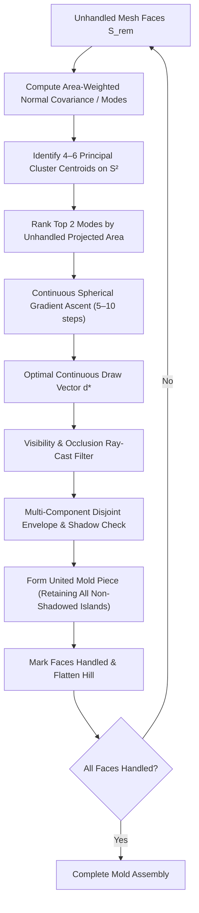

# Mold Draw Direction Optimizer: Architecture & Design Document

**Status:** Proposed  
**Author:** AI Agent & User Pair  
**Domain:** Geometry Engine / Mold Decomposition (`geo/ops/mold/`)  
**Target Components:** [`geo/ops/mold/optimizer.h`](file:///home/brian/github/jotcad_ez/geo/ops/mold/optimizer.h), [`geo/ops/mold/partition.h`](file:///home/brian/github/jotcad_ez/geo/ops/mold/partition.h)

---

## 1. Executive Summary & Problem Context

The JotCAD mold decomposition engine automatically partitions a 3D CAD mesh into a minimal set of rigid mold blocks that can be extracted cleanly along directional pull vectors ($\vec{d}$) without collision, undercuts, or vacuum lock.

In empirical tests on the **Voxel Bear** ([`geo/test/mold_voxel_bear_test.cpp`](file:///home/brian/github/jotcad_ez/geo/test/mold_voxel_bear_test.cpp)), the current baseline decomposition produced **6 mold pieces** (5 moving + 1 stationary) instead of an expected 3-piece assembly. Most critically, the test revealed the exact smoking-gun failure mechanism: **Piece 2 and Piece 4 shared the identical draw vector to 6 decimal places**:
$$\vec{d}_2 = \vec{d}_4 = (-0.754409, \; -0.411371, \; +0.511508)$$

The optimizer re-selected the identical vector in a later step because the current code strictly limited Piece 2 to its single largest DSU component (63 faces), discarding the disjoint foot faces (8 faces) and forward-facing sprue faces (111 faces), forcing the engine to generate redundant pieces.

This document synthesizes:
1. **The physical kinematics of zero-draft and opposed perpendicular pulls** (friction, galling, vacuum lock, clay tearing).
2. **The root causes of failure in the current optimizer** (Fibonacci lattice quantization, candidate clustering, and single-component island rejection).
3. **The Preferred Design**: **Normal Mode Clustering + Continuous Spherical Hill Climbing** with **Disjoint Patch Support**.
4. **Analysis of Alternative Optimization Strategies** (Simulated Annealing, Great Circle Arrangements, Hierarchical Spherical Grids).

---

## 2. Background: Manufacturing Kinematics & Lessons Learned

### 2.1 The Physics of Zero Draft & Opposed Perpendicular Faces
In mold engineering (injection molding, die casting, and plaster slipcasting), pulling a mold piece out between two opposed perpendicular walls (e.g., pulling a cube sideways) is an acute failure mode:

| Property | Drafted Pull ($\theta > 0^\circ$) | Zero-Draft Orthogonal Pull ($\theta = 0^\circ$) |
| :--- | :--- | :--- |
| **Clearance Gap** | $\delta(x) = x \cdot \sin\theta$ (opens immediately) | $\delta(x) = 0$ for entire stroke length |
| **Surface Contact** | Disengages on step 1 of motion ($< 0.01\,\text{mm}$) | Intimate frictional contact across full travel |
| **Failure in Slipcasting** | Clean separation | High shear tearing greenware skin; vacuum lock suction |
| **Failure in Tooling** | Long tool life | Galling, adhesive wear, thermal shrinkage clamping |

* **Why pure orthogonal pulls along cardinal axes are traps**: A purely horizontal pull relative to a rectilinear/voxel part forces all horizontal floors and ceilings into exact $0^\circ$ sliding friction.
* **Why diagonal pulls succeed**: Angling the pull vector off-axis gives positive clearance to multiple perpendicular planes simultaneously, converting pure shear into normal separation.

### 2.2 Root Causes Confirmed by Unit Test Baseline
Our empirical verification in [`geo/test/mold_voxel_bear_test.cpp`](file:///home/brian/github/jotcad_ez/geo/test/mold_voxel_bear_test.cpp) confirmed three critical flaws:

```
┌─────────────────────────────────────────────────────────────────────────────┐
│                      Current Optimizer Pipeline Flaws                       │
├─────────────────────────────────────────────────────────────────────────────┤
│ 1. Search Grid Coarseness (±6° quantization error)                          │
│    • 300-point Fibonacci sphere has ~11.7° angular spacing.                 │
│    • Tipped draw vector off the equator by -6°, crossing the draft limit   │
│      and severing the continuous shoulder patch.                            │
│                                                                             │
│ 2. Feature Normal Clustering (26 duplicate spikes)                          │
│    • Injected hundreds of duplicate face, edge, and corner normals.         │
│    • On voxel parts, these all collapse onto the same 26 directions,        │
│      leaving the rest of the sphere empty.                                  │
│                                                                             │
│ 3. Disconnected Component Rejection Bug (L149-167)                          │
│    • Patch DSU partitioned visible faces into connected components.         │
│    • The optimizer kept ONLY `largest_comp` (63 faces) and discarded the    │
│      disjoint feet (8 faces) and sprue faces (111 faces), even though they  │
│      had positive draft along the SAME vector d2 = (-0.754, -0.411, +0.512)!│
│    • The engine subsequently generated Piece 4 along that exact same vector!│
└─────────────────────────────────────────────────────────────────────────────┘
```

---

## 3. Core Design Goals & Requirements

1. **Disjoint Patch Support (MANDATORY)**:
   * A single rigid mold block must be allowed to demold **multiple disconnected surface patches** (e.g., the belly, the sprue base, and the paws) provided they all share the draw direction $\vec{d}$ and do **not occlude or shadow one another** along $\vec{d}$.
2. **Sub-Degree Continuous Precision**:
   * Eliminate angular quantization error. Pull directions must converge to the true continuous local summit of draft and visibility on $\mathbb{S}^2$, rather than the nearest arbitrary sample point.
3. **Draft Safety & Robustness**:
   * Maximize the minimum positive draft across the patch. Push parting lines far away from zero-draft knife edges.
4. **100% Determinism (JotCAD Stable CID Mandate)**:
   * All draw vectors, parting curves, and mold solid geometries must be bit-for-bit deterministic across platforms and builds. Stochastic or randomized algorithms are strictly unacceptable.
5. **High Performance**:
   * Complete the optimization in $< 5\,\text{ms}$ with fewer than 25 candidate evaluations (down from 400+).

---

## 4. The Preferred Architecture: Normal Mode Clustering + Spherical Hill Climbing

The core insight is that **the search space is a 2D surface ($\mathbb{S}^2$), and we already possess the complete normal distribution that generates all the hills.**



### 4.1 Step 1: Normal Mode Clustering (Finding the Hills)
Rather than spraying random rays or testing hundreds of mesh facets, compute the **Normal Orientation Tensor** of the remaining unhandled faces $S_{\text{rem}}$:
$$\mathbf{T} = \sum_{f \in S_{\text{rem}}} A_f \, \mathbf{n}_f \mathbf{n}_f^T$$

The eigenvectors of $\mathbf{T}$ define the principal axes of the geometry. Together with a fast spherical $k$-means ($k = 6$), this partitions the normals into 4 to 6 dominant directional modes:
$$\mathbf{C}_k = \frac{\sum_{f \in \text{Cluster}_k} A_f \mathbf{n}_f}{\left\| \sum_{f \in \text{Cluster}_k} A_f \mathbf{n}_f \right\|}$$
Each centroid $\mathbf{C}_k \in \mathbb{S}^2$ sits directly at the base of one of the natural hills on the sphere.

### 4.2 Step 2: Continuous Spherical Hill Climbing
From the top candidate mode $\mathbf{C}_k$, we perform **spherical gradient ascent** on the continuous manifold $\mathbb{S}^2$.

Let the objective function on $\mathbb{S}^2$ be:
$$F(\mathbf{d}) = \sum_{f \in \text{Visible}(\mathbf{d}) \cap S_{\text{rem}}} A_f \cdot \left( \mathbf{n}_f \cdot \mathbf{d} - \sin\alpha_{\text{min}} \right)$$

The unconstrained gradient in $\mathbb{R}^3$ is simply the area-weighted sum of visible normals:
$$\mathbf{G}(\mathbf{d}) = \nabla F(\mathbf{d}) = \sum_{f \in \text{Visible}(\mathbf{d}) \cap S_{\text{rem}}} A_f \mathbf{n}_f$$

To remain on the unit sphere $\mathbb{S}^2$, project the gradient onto the tangent plane at $\mathbf{d}$:
$$\mathbf{G}_{\mathbb{S}^2}(\mathbf{d}) = (\mathbf{I} - \mathbf{d}\mathbf{d}^T)\mathbf{G}(\mathbf{d})$$

Update with step size $\eta$ and re-normalize:
$$\mathbf{d}^{(t+1)} = \frac{\mathbf{d}^{(t)} + \eta \mathbf{G}_{\mathbb{S}^2}(\mathbf{d}^{(t)})}{\left\| \mathbf{d}^{(t)} + \eta \mathbf{G}_{\mathbb{S}^2}(\mathbf{d}^{(t)}) \right\|}$$

Because $\mathbf{d}$ starts at the cluster centroid, the summit is typically reached in **5 to 8 iterations**.

#### 4.3 Step 3: Disjoint Patch Support (Multi-Component Extraction)
This resolves the smoking gun bug where Piece 2 excluded the sprue and feet.

1. **Extract All Positive-Draft Visible Faces**:
   Find all unhandled faces $f \in S_{\text{rem}}$ satisfying:
   $$\mathbf{n}_f \cdot \mathbf{d}^* \ge \sin\alpha_{\text{min}} \quad \text{and} \quad \text{Ray}(c_f, \mathbf{d}^*) \cap \text{Mesh} = \emptyset$$
2. **Decompose into Connected Components**:
   Group visible faces into components $\{K_1, K_2, \dots, K_m\}$ via half-edge connectivity (`patch_dsu`).
3. **Per-Component Boundary Cycle Topology Check**:
   * **The Old Flaw**: The optimizer ran `border_halfedges` across the *entire patch* and required `cycle_count == 1`. If two separate disks were united, `border_halfedges` returned 2 boundary loops. The old code falsely rejected this as a hole!
   * **The Design Rule**: Compute boundary cycles **per component** $C(K_i)$ on `mesh_part`.
     * If $C(K_i) = 1$: Component $K_i$ is a topological disk with zero internal holes (demoldable!).
     * If $C(K_i) > 1$: Component $K_i$ contains internal undercut holes and is penalized.
   * Uniting $M$ valid disjoint disk components produces $M$ external boundary cycles, which is geometrically valid for multi-component demolding.
4. **Mutual Occlusion / Shadow Test & Aggregation**:
   Two disjoint components $K_a$ and $K_b$ can be demolded by the **same rigid mold piece** if neither component casts a shadow onto the other along vector $\mathbf{d}^*$:
   * In projection along $\mathbf{d}^*$, check 2D bounding boxes and ray clearance.
   * Combine all non-occluding disk components into `united_patch_faces`.
5. **United Upper Envelope**:
   Generate the sweep corridor / wedge envelope via `CGAL::upper_envelope_3`, which processes all triangles from all united components simultaneously and builds a single watertight mold block.

---

## 5. Evaluation of Alternative Approaches

| Approach | Determinism | Convergence Speed | Angular Precision | Risk / Weakness | Recommendation |
| :--- | :--- | :--- | :--- | :--- | :--- |
| **1. Mode Clustering + Spherical Hill Climb** | **100% Exact** | **5–10 evals (<1ms)** | **Continuous ($\ll 0.1^\circ$)** | Minor non-smoothness across shadow lines (handled by multi-start) | **PREFERRED** |
| **2. Status Quo (300 Fibonacci + Feature Normals)** | 100% Exact | 400+ evals (~15ms) | Coarse ($\sim 11.7^\circ$) | Severe quantization error; extreme voxel clustering; blind spots | **DEPRECATE** |
| **3. Simulated Annealing on $\mathbb{S}^2$** | Stochastic / Fragile | 150–300 evals | Variable | Non-deterministic (breaks JotCAD CIDs); wanders in 2D space | **REJECT** |
| **4. Great Circle Spherical Arrangements** | 100% Exact | Combinatorial explosion | Exact boundaries | Targets zero-draft failure lines; $O(N^2)$ cells for 1,000 faces | **REJECT** |
| **5. Hierarchical Adaptive Spherical Grid** | 100% Exact | 40–80 evals | High (multi-level) | More complex code than hill climbing; still grid-constrained | **BACKUP** |

### Detailed Evaluation of Alternatives

#### A. Simulated Annealing
* **Concept**: Randomly perturb $\mathbf{d}$ on $\mathbb{S}^2$, accepting downhill moves with probability $e^{-\Delta E / T}$.
* **Why Rejected**:
  1. *CID Stability*: In JotCAD, every compilation must produce stable cryptographic hashes. Stochastic steps require rigid pseudo-random seeding, which remains brittle across architectures and compilers.
  2. *Dimensional Inefficiency*: Simulated Annealing is designed for high-dimensional combinatorial problems ($D > 10$). In a 2D space where the gradient $\nabla F(\mathbf{d})$ is directly computable in $O(M)$, stochastic random walking is wasteful and slow.

#### B. Great Circle Arrangements (Spherical Gauss Map)
* **Concept**: Intersect the zero-draft equators $\mathbf{n}_f \cdot \mathbf{d} = 0$ for all faces to create an exact cellular decomposition of $\mathbb{S}^2$.
* **Why Rejected**:
  1. *Zero-Draft Danger*: The vertices of great circle intersections are precisely where multiple faces have exact $0.0^\circ$ draft—the exact configuration that causes tooling galling and clay tearing.
  2. *Complexity*: 1,000 faces yield up to 1,000,000 spherical cells, requiring heavy rational spherical geometry kernels for no practical gain.

---

## 6. Implementation Plan & Milestones

### Phase 1: Verify Empirical Baseline with Dedicated Unit Test (COMPLETED)
* ✅ Created standalone unit test [`geo/test/mold_voxel_bear_test.cpp`](file:///home/brian/github/jotcad_ez/geo/test/mold_voxel_bear_test.cpp).
* ✅ Verified standalone compilation in `geo/test/Makefile` and registered `"test:bear:voxel"`.
* ✅ Executed baseline run: Confirmed that Piece 2 and Piece 4 share the exact same draw vector $\mathbf{d}_2 = \mathbf{d}_4 = (-0.754409, -0.411371, +0.511508)$, and confirmed that 111/117 unhandled sprue faces are forward-facing under $\mathbf{d}_2$.
* ✅ Baseline committed cleanly at `f140a97`.

### Phase 2: Disjoint Component Retention in [`optimizer.h`](file:///home/brian/github/jotcad_ez/geo/ops/mold/optimizer.h) (CURRENT)
* Replace the greedy single-island `largest_comp` filter with per-component cycle checking ($C(K_i) == 1$) and multi-component aggregation.
* Pass all non-occluding components sharing $\mathbf{d}^*$ into `best_patch_faces`.
* Verify via `npm run test:bear:voxel` that Piece 2 absorbs the feet and sprue faces, eliminating Piece 4 and reducing piece count.

### Phase 3: Mode Clustering & Spherical Hill Climbing Engine
* Implement `compute_normal_modes(mesh_part, unhandled_faces, k=6)`.
* Implement `climb_spherical_hill(initial_d, unhandled_faces)`.
* Replace the 300 Fibonacci loop and geometry-informed candidate arrays.
* Re-verify compilation, performance benchmarks, and regression tests.

---

## 7. Design Decisions & Open Questions

1. **Mutual Occlusion Verification (DECIDED)**:
   * 2D projection non-overlap along $\mathbf{d}^*$ combined with `CGAL::upper_envelope_3` depth resolution provides exact, collision-free demolding without requiring expensive 3D Minkowski swept volumes.
2. **Number of Initial Modes ($K$)**:
   * For typical slipcast parts (figurines, cups, slip molds), $K = 6$ corresponds naturally to the 6 generalized faces (front, back, left, right, top, bottom). Should $K$ be dynamic based on eigenvalue ratios of the normal tensor?
