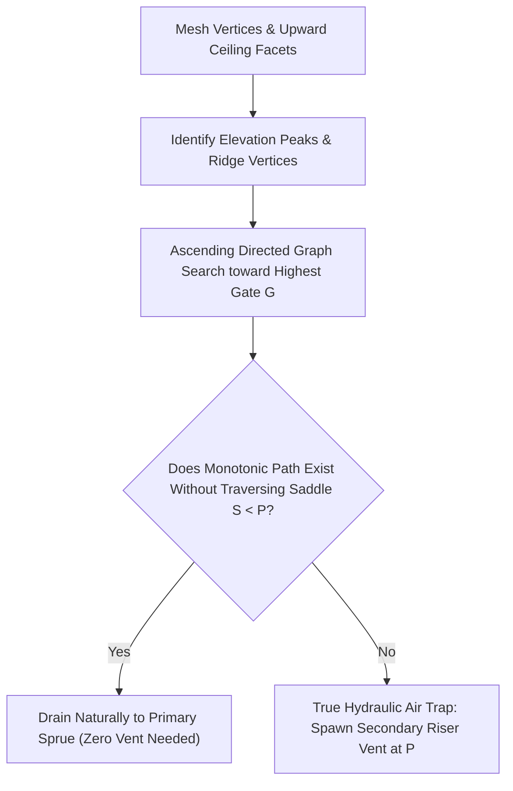

# Technical Design Document: Gravity Pour Orientation & Topological Drainage Engine

**Status**: Approved Architecture & Implementation Plan  
**Target Architecture**: JotCAD Pour Preparation Pipeline (`geo/ops/pour/`)  
**Domain**: Automated Gravity Pour Orientation, Morse Air Trap Detection, Bubble Drainage Physics, Sprue/Riser Synthesis  
**Target Headers**: [`geo/ops/pour/orientation.h`](file:///home/brian/github/jotcad_ez/geo/ops/pour/orientation.h), [`geo/ops/pour/traps.h`](file:///home/brian/github/jotcad_ez/geo/ops/pour/traps.h), [`geo/ops/pour/vents.h`](file:///home/brian/github/jotcad_ez/geo/ops/pour/vents.h), [`geo/ops/pour/types.h`](file:///home/brian/github/jotcad_ez/geo/ops/pour/types.h)

---

## 1. Executive Summary & Physical Foundations

In slip casting, casting resin, and gravity die casting, orientation determines both cavity filling dynamics and air bubble evacuation. Prior to multi-piece mold decomposition ([`docs/MOLD_DRAW_DIRECTION_OPTIMIZER_DESIGN.md`](./MOLD_DRAW_DIRECTION_OPTIMIZER_DESIGN.md)), `pourPrep` rotates the model to:
1. Place a primary pour funnel (sprue/gate) at a natural, non-cosmetic entry point.
2. Ensure every internal face drains bubbles upward without air entrapment.
3. Minimize the number of secondary auxiliary riser vents that mar finished surfaces.

```
       Buoyant Bubble Ascent along Ceiling
              \
               \   Ceiling Angle α ≥ 5°
    Air Bubble  O ↗  F_B,∥ = ρ_slip · g · V · sin α
                 \
                  \───────────────────── Plaster Mold Wall
                   [Impermeable Clay Filter Cake]
```

### 1.1 Slip Casting Drainage Physics: Air vs. Water Permeability
* **Capillary Suction of Water**: Dry gypsum plaster ($\text{CaSO}_4 \cdot \frac{1}{2}\text{H}_2\text{O}$) possesses pore diameters of $0.1\text{--}5\,\mu\text{m}$, generating massive capillary suction pressures ($0.1\text{--}1\,\text{MPa}$) that draw water out of the ceramic slip.
* **Impermeable Clay Filter Cake**: The instant liquid slip contacts the plaster, clay platelets pack into a dense boundary cake whose thickness grows as $\delta(t) \propto \sqrt{t}$. This water-saturated clay membrane is virtually impermeable to air under typical hydrostatic casting heads ($\rho g h \approx 1\text{--}5\,\text{kPa}$).
* **Consequence**: **Air cannot escape through the mold wall.** Any bubble pinned against a horizontal ceiling or trapped in a local pocket remains permanently embedded, causing pinholes, blowholes, or structural voids in the greenware.

### 1.2 Bubble Detachment & Force Balance
For a trapped air bubble of volume $V = \frac{4}{3}\pi R^3$ along a ceiling inclined at angle $\alpha$ relative to horizontal:
* **Net Upward Buoyancy**: $F_B = (\rho_{\text{slip}} - \rho_{\text{air}}) g V \approx \rho_{\text{slip}} g V$.
* **Parallel Driving Force**: $F_{B,\parallel} = F_B \sin\alpha = \rho_{\text{slip}} g V \sin\alpha$.
* **Resisting Forces**: Surface tension / contact angle hysteresis ($F_\sigma$) and Bingham plastic yield stress ($F_\tau$).
* **Physical Detachment Thresholds**:
  * **$\alpha = 0^\circ$ (Dead Flat Ceiling)**: $F_{B,\parallel} = 0$. Bubbles remain pinned $100\%$ of the time.
  * **$\alpha = 3^\circ\text{--}5^\circ$**: Minimum detachment threshold for millimeter-scale bubbles in deflocculated ceramic slip ($\rho \approx 1.8\,\text{g/cm}^3$). Once detached, bubbles slide along the ceiling.
  * **$\alpha \ge 10^\circ\text{--}15^\circ$**: Conservative foundry rule of thumb guaranteeing rapid evacuation across high-viscosity slips.
  * **Design Minimum Angle**: Set $\alpha_{\text{min}} = \mathbf{5^\circ}$ ($5.0 / 360.0 \approx 0.01389$ turns) as the physical detachment limit for gravity drainage.

---

## 2. Failure Mode Analysis on Prismatic Geometries

In empirical tests on a 2-way planar cross (`Box(30,10,10).fuse([Box(10,30,10)])`, Snapshot 528), `pourPrep(auto_orient=true, vents=true)` produced **two unnecessary secondary vents** (`air_vent_1` and `air_vent_2`) on opposite ends of a single straight horizontal bar. Root-cause analysis revealed four interconnected flaws:

```
                  Snapshot 528 Failure Mechanism
                 
                       [Primary Pour Sprue]
                              ▲
                             / \
                            /   \
   False Vent 1 ◄── [Arm 1]       [Arm 2] ──► False Vent 2
                      |               |
                      +--- 10mm ---+--+
                           Width
            (Roll angle = 0°: Tied peaks across 10mm thickness;
             Naive 1-ring check cuts straight ridge into isolated tips)
```

1. **Naive 1-Ring Vertex Peak Check (`traps.h`)**: Flagged vertices as summits using purely local neighbor checks, cutting a continuous downward-sloping ridge into isolated tips.
2. **Absence of Compound Tilts in Predefined Candidates (`orientation.h`)**: Evaluated only cardinal axes and pure diagonals ($45^\circ$ in XY, $0^\circ$ in Z). The thickness axis remained completely horizontal.
3. **Fibonacci Grid Coarseness ($\approx 16.6^\circ$)**: 150 points on $\mathbb{S}^2$ jumped past the subtle $5^\circ\text{--}8^\circ$ compound roll needed to pitch the roof cross-section.
4. **The Heuristic Weight Trap ($500.0 \times \text{Area}$)**: A $5^\circ$ tilt made broad lateral faces ($500\,\text{mm}^2$) into shallow ceilings. Because `min_angle = 15.0 / 360.0` and penalty was weighted at $500.0$, the penalty exploded ($> 20,000$ points), drowning out the discrete vent cost and falsely rejecting the compound tilt.

---

## 3. Topological Drainage Architecture: The Hydraulic Saddle Model



### 3.1 Mathematical Definition of an Air Trap
Let cavity ceiling be the upper surface $\partial M_{\text{up}} = \{ f \in \partial M \mid \vec{n}_f \cdot \hat{z} > 0 \}$.
During filling, the liquid-air interface rises as a horizontal level-set plane $\mathcal{L}_z = \{ p \in \mathbb{R}^3 \mid Z(p) = z \}$.

1. **Hydraulic Saddle Condition**: A local peak $P$ traps air if and only if **every continuous ceiling path** $\gamma: [0, 1] \to \partial M_{\text{up}}$ connecting $P$ to the primary atmospheric pour gate $G$ passes through an elevation saddle $S$ strictly lower than $P$:
   $$\max_{\gamma \in \Gamma(P, G)} \min_{t \in [0, 1]} Z(\gamma(t)) = Z(S) < Z(P)$$
2. **Trapped Volume**: When liquid rises to $z = Z(S)$, the saddle is submerged. The air pocket above $S$ is sealed off from the atmosphere, trapping a pocket of height $\Delta h = Z(P) - Z(S)$.
3. **Monotonic Drainage Invariant**: If there exists at least one non-decreasing path ($\frac{d}{dt}Z(\gamma(t)) \ge -\delta_{\text{cap}}$) from $P$ to $G$, rising liquid displaces air smoothly toward $G$. **No auxiliary vent is placed.**

---

## 4. The Pitfalls of Heuristic Optimizers

Our research evaluated four candidate paradigms:

| Method | Precision | Fragility & Traps | Verdict |
| :--- | :--- | :--- | :--- |
| **Weighted Sum ($w_1 N + w_2 \Phi$)** | Continuous | **Tuning Trap**: Arbitrary weights ($5000, 500, 100$) compete; large faces overpower vents. | **REJECT** |
| **Simulated Annealing Walk** | $\sim 0.5^\circ$ | **Brownian Trap**: Blind random walking; fragile cooling schedules; non-geometric. | **REJECT** |
| **Exact 2D Spherical Arrangement** | Exact | **Brittleness Trap**: $O(E^2)$ combinatorial explosion; collapses on over-constrained models. | **REJECT** |
| **Lexicographic (Tiered) Evaluation** | Exact | **Zero weights**: Strict hierarchy eliminates weight competition and never crashes. | **PREFERRED** |

---

## 5. The Preferred Architecture: Lexicographic (Tiered) Optimization

Instead of a single scalar score with magic weights, candidate orientations $\vec{d} \in \mathbb{S}^2$ are evaluated in **Strict Hierarchical Tiers (Lexicographic Ordering)**:

```
                           Lexicographic Evaluation (Zero Weights)
                           
               Candidate Orientation Vector d ∈ S²
                               │
                               ▼
        ┌──────────────────────────────────────────────┐
        │ Tier 1 (Absolute Priority):                  │
        │ Count True Hydraulic Traps N_traps(d)        │ ◄── Pure Integer (0, 1, 2...)
        └──────────────────────┬───────────────────────┘     (Computed via Watershed DAG)
                               │ Only compare if N_traps is tied
                                ▼
        ┌──────────────────────────────────────────────┐
        │ Tier 2 (Physical Drainage Hazard):           │
        │ Flat Ceiling Hazard Area with α < 5°         │ ◄── Pure Physical Area (mm², lower is better)
        └──────────────────────┬───────────────────────┘
                               │ Only compare if flat hazard area is tied
                               ▼
        ┌──────────────────────────────────────────────┐
        │ Tier 3 (Drainage Quality / Upright Stance):  │
        │ Drainage Slope Power (∑ sin α_f · Area_f)    │ ◄── Pure Buoyancy Gradient (mm², higher is better)
        └──────────────────────────────────────────────┘
```

### 5.1 Strict Comparison Rule
Candidate $\vec{d}_A$ is strictly better than $\vec{d}_B$ ($\vec{d}_A \prec \vec{d}_B$) if and only if:
1. **Tier 1 (Zero Vent Mandate)**: $N_{\text{traps}}(\vec{d}_A) < N_{\text{traps}}(\vec{d}_B)$ (Fewer vents ALWAYS wins; a 0-vent candidate strictly beats a 1-vent candidate. Computed via the Hydraulic Watershed DAG).
2. **Tier 2 (Tie-breaker)**: If $N_{\text{traps}}(\vec{d}_A) == N_{\text{traps}}(\vec{d}_B)$, then $\text{Area}_{\text{flat}}(\vec{d}_A) < \text{Area}_{\text{flat}}(\vec{d}_B)$ (Minimizes surface area susceptible to bubble pinning).
3. **Tier 3 (Tie-breaker)**: If flat ceiling hazard areas are equal, then $\text{Power}_{\text{drain}}(\vec{d}_A) > \text{Power}_{\text{drain}}(\vec{d}_B)$ (Maximizes average upward drainage slope $\sum \sin\alpha_f \cdot \text{Area}_f$, strictly favoring tall upright stances over flat orientations).

**There are ZERO arbitrary weights.** Pure integer vent counts, hazard areas ($\text{mm}^2$), and drainage gradients never cross-multiply.

---

## 6. Deterministic Candidate Generation with Canonical Compound Offsets

Instead of an intractable 9,000,000-cell spherical arrangement or a blind random walk, candidates are generated deterministically from the model's geometric symmetry axes:

```
                         Candidate Generation Pipeline
┌─────────────────────────────────────────────────────────────────────────────┐
│ 1. Cardinal Axes: (±1, 0, 0), (0, ±1, 0), (0, 0, ±1)                        │
│ 2. Dominant Face Normals: Top normal cluster modes                          │
│ 3. 45° Planar Diagonals: (±1, ±1, 0), (±1, 0, ±1), (0, ±1, ±1)              │
│ 4. Canonical Compound Tangent Offsets:                                      │
│    For each diagonal d0 with tangent basis (u, v):                          │
│        d = normalize( d0 ± sin(6°)·u ± sin(6°)·v )                          │
└─────────────────────────────────────────────────────────────────────────────┘
```

### 6.1 The Tangent Compound Offset Formulation
For every primary candidate $\vec{d}_0$, construct an orthonormal tangent frame $(\vec{u}, \vec{v}) \perp \vec{d}_0$:
$$\vec{d}(\pm \delta_u, \pm \delta_v) = \text{normalize}\left( \vec{d}_0 \pm \sin(6^\circ)\vec{u} \pm \sin(6^\circ)\vec{v} \right)$$
Where $\delta = 6^\circ$ ($\sin 6^\circ \approx 0.104528$) directly satisfies the bubble detachment threshold $|\hat{e} \cdot \vec{d}| \ge \sin(5^\circ)$.

### 6.2 Computational Complexity
* Projecting $N_v$ vertices and $N_f$ face normals onto candidate vector $\vec{d}$ requires **zero mesh transformations**:
  $$Z(p_i) = \vec{p}_i \cdot \vec{d}, \quad \cos\alpha_f = \vec{n}_f \cdot \vec{d}$$
* Total candidate set is $\approx 40\text{--}60$ structured directions.
* Total execution time is **$< 1.0\,\text{ms}$** across the entire pipeline.

---

## 7. Architectural Invariants & Protocol Compliance

1. **Exact Kernel Purity**: All vertex evaluations, dot products, and mesh coordinates remain in `EK::FT`. Double conversions are strictly confined to transcendental trigonometric candidate generation and lexicographic sorting.
2. **Deterministic Hashing**: The output mesh from `pourPrep` maintains bit-for-bit determinism across compiler toolchains. Zero random number generators.
3. **Flush Stock Trimming Consistency**: Primary sprues and auxiliary riser vents are trimmed flush to the bounding mold stock envelope ($Z = Z_{\text{stock,max}}$), ensuring clean coplanar demolding interfaces.

---

## 8. Implementation Roadmap

| Phase | Milestone | Key Deliverables |
| :--- | :--- | :--- |
| **Phase 1** | Lexicographic Evaluator | Replace weighted sum in `orientation.h` with Tier 1/2/3 lexicographic comparison. |
| **Phase 2** | Compound Tangent Offsets | Generate canonical $6^\circ$ orthogonal compound roll candidates in `orientation.h`. |
| **Phase 3** | Topological Watershed Search | Replace 1-ring vertex test in `traps.h` with monotonic bottleneck path reachability. |
| **Phase 4** | Unit Test Verification | Verify 2-Way Planar Cross reduces from 2 vents to 0 secondary vents with clean pour sprue. |

---

## 9. Cross References
* Multi-Piece Mold Decomposition: [`docs/MOLD_DRAW_DIRECTION_OPTIMIZER_DESIGN.md`](file:///home/brian/github/jotcad_ez/docs/MOLD_DRAW_DIRECTION_OPTIMIZER_DESIGN.md)
* Pour Directory Index: [`geo/ops/pour/README.md`](file:///home/brian/github/jotcad_ez/geo/ops/pour/README.md)
* Operations Reference: [`docs/OPERATIONS_REFERENCE.md`](file:///home/brian/github/jotcad_ez/docs/OPERATIONS_REFERENCE.md)
